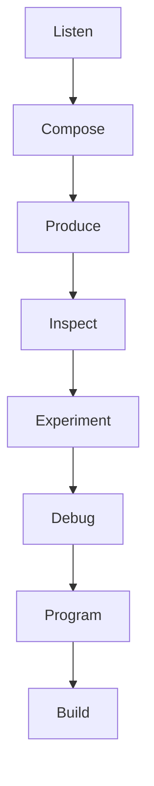
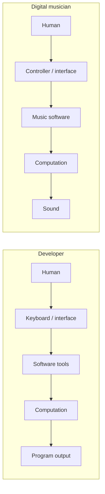

# The Idea of Tech Music

A laptop can be where a deadline lives and where a new sound begins. The same machine that compiles a program can sequence a rhythm, calculate a waveform, and turn gestures into recordings. This book starts with that double life.

## A working concept, not a genre

**Tech music** is this book’s working name for primarily digital, often instrumental electronic music considered in two related ways: as a possible environment for focused technical work, and as an inviting route into how music technology is made. It is not an established genre, a scientific classification, or a playlist prescription.

That distinction matters. *Electronic music* is a broad family of practices involving electronic sound production. *Ambient*, *house*, and *techno* have particular histories and conventions; none is simply another name for tech music. *Background music* describes a listening role, not a style. Music can move between foreground and background as attention changes.

This definition is deliberately open. A reader’s tech music might include acoustic recordings, lyrics, game music, field recordings, or silence. “Primarily digital” describes the book’s technical route, not a gate around anyone’s taste.

## Work, craft, and curiosity

Technical work is not one mental activity. Tracing an unfamiliar call stack, entering data, sketching an interface, and naming a new system demand different kinds of attention. Music may feel welcome in one and intrusive in another. Chapter 2 treats that as a question to investigate rather than a claim to prove.

The artistic relationship is easier to state: computers offer materials for making music. A grid can become a rhythm; a number can become pitch; a function can become a sound. A technologist who asks, “Why does this loop feel continuous?” has already crossed from listening into design.

The arrows show a reader journey, not prerequisites. You may debug before composing or listen again after building. The point is to turn passive familiarity into active questions.

## Two workstations

This is an analogy, not an assertion that sound and program output are identical. Both systems translate human intentions through interfaces and computation. Their constraints differ: audio must unfold in time, while many software outputs can wait.

## Questions to carry forward

What do you notice when music accompanies work? How do repetition and change shape a track? What does a synthesizer compute? How do samples become playback? How can a bug become audible evidence? Later parts develop music fundamentals, sequencing, DAWs, synthesis, digital audio, DSP, MIDI, and software systems. For now, listening is enough to begin.

## Listening lab: foreground and background

**Objective:** Notice attention moving between task and music. 
**Listening setup:** Choose one familiar track you may legally access; set a safe, comfortable level. 
**What to listen for:** Moments when rhythm, timbre, words, or a change pulls the track forward. 
**Comparison conditions:** Listen once without another task; then during five minutes of a low-stakes familiar task. 
**Record:** task, track familiarity, attention shifts, enjoyment, and any urge to stop or skip. 
**Reflection:** Did the music change, or did its role in your attention change? 
**Limitations:** This short self-observation cannot establish a productivity effect or generalize to other people.

## References

1. [Bibliography 6](../../references/bibliography.md#6)—a broad account of electronic and experimental music practices.
2. [Bibliography 7](../../references/bibliography.md#7)—ambient music as a historically situated practice.
