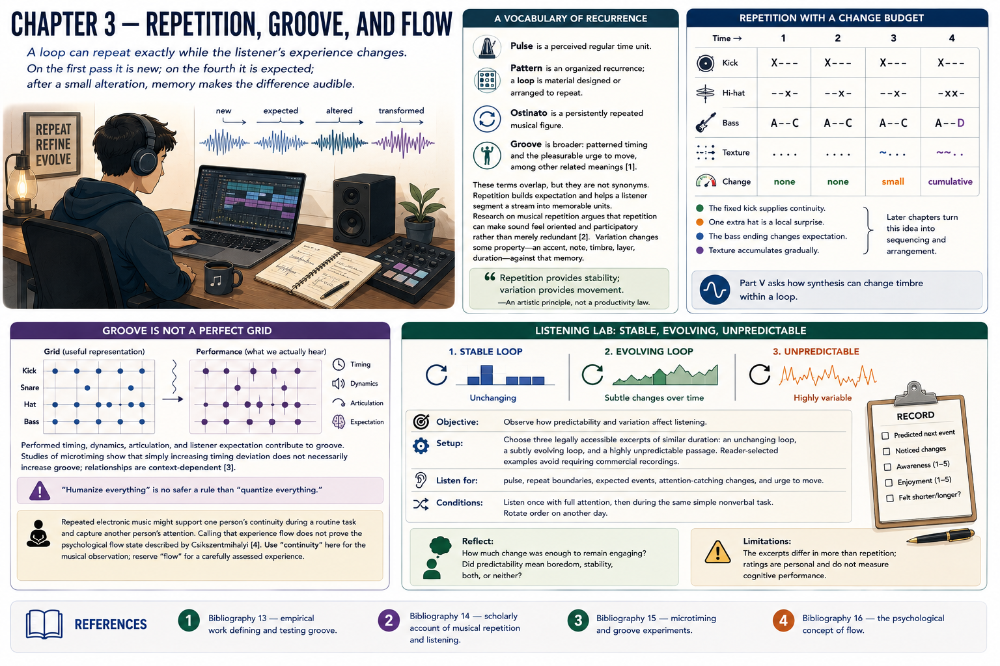

# Chapter 3 — Repetition, Groove, and Flow



A loop can repeat exactly while the listener’s experience changes. On the first pass it is new; on the fourth it is expected; after a small alteration, memory makes the difference audible.

## A vocabulary of recurrence

A **pulse** is a perceived regular time unit. A **pattern** is an organized recurrence; a **loop** is material designed or arranged to repeat. An **ostinato** is a persistently repeated musical figure. **Groove** is broader: musicians and researchers use it for patterned timing and for the pleasurable urge to move, among other related meanings [1]. These terms overlap, but they are not synonyms.

Repetition builds expectation and helps a listener segment a stream into memorable units. Research on musical repetition argues that repetition can make sound feel oriented and participatory rather than merely redundant [2]. **Variation** changes some property—an accent, note, timbre, layer, duration—against that memory.

> Repetition provides stability; variation provides movement.

That is an artistic principle, not a productivity law.

## Repetition with a change budget

```text
Time →      1       2       3       4
Kick        X---    X---    X---    X---
Hi-hat      --x-    --x-    --x-    -xx-
Bass        A--C    A--C    A--C    A--D
Texture     ....    ....    ~...    ~~..
Change      none    none    small   cumulative
```

The fixed kick supplies continuity. One extra hat is a local surprise; the bass ending changes expectation; texture accumulates gradually. Later chapters turn this idea into sequencing and arrangement. Part V asks how synthesis can change timbre within a loop.

## Groove is not a perfect grid

A grid is a useful representation, but performed timing, dynamics, articulation, and listener expectation contribute to groove. Studies of microtiming show that simply increasing timing deviation does not necessarily increase groove; relationships are context-dependent [3]. “Humanize everything” is no safer a rule than “quantize everything.”

Likewise, repeated electronic music might support one person’s continuity during a routine task and capture another person’s attention. Calling that experience *flow* does not prove the psychological flow state described by Csikszentmihalyi [4]. In this chapter, use “continuity” for the musical observation and reserve “flow” for a carefully assessed experience.

## Listening lab: stable, evolving, unpredictable

**Objective:** Observe how predictability and variation affect listening.<br>
**Setup:** Choose three legally accessible excerpts of similar duration: an unchanging loop, a subtly evolving loop, and a highly unpredictable passage. Reader-selected examples avoid requiring commercial recordings.<br>
**Listen for:** pulse, repeat boundaries, expected events, attention-catching changes, and urge to move.<br>
**Conditions:** Listen once with full attention, then during the same simple nonverbal task. Rotate order on another day.<br>
**Record:** predicted next event, noticed changes, awareness (1–5), enjoyment (1–5), and whether the excerpt felt shorter or longer than expected.<br>
**Reflect:** How much change was enough to remain engaging? Did predictability mean boredom, stability, both, or neither?<br>
**Limitations:** the excerpts differ in more than repetition; ratings are personal and do not measure cognitive performance.

## References

1. [Bibliography 13](../../references/bibliography.md#13)—empirical work defining and testing groove.
2. [Bibliography 14](../../references/bibliography.md#14)—scholarly account of musical repetition and listening.
3. [Bibliography 15](../../references/bibliography.md#15)—microtiming and groove experiments.
4. [Bibliography 16](../../references/bibliography.md#16)—the psychological concept of flow.
