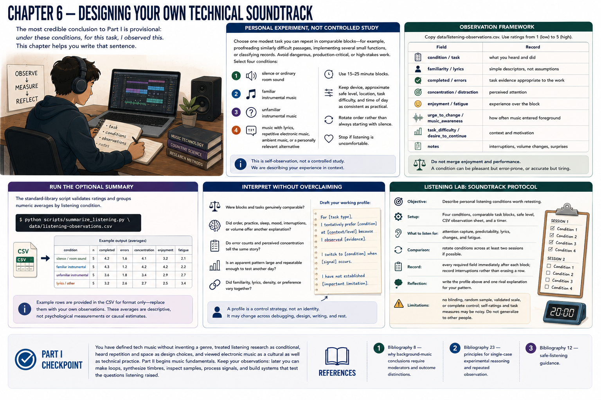

# Chapter 6 — Designing Your Own Technical Soundtrack



The most credible conclusion to Part I is provisional: *under these conditions, for this task, I observed this*. This chapter helps you write that sentence.

## Personal experiment, not controlled study

Choose one modest task you can repeat in comparable blocks—for example, proofreading similarly difficult passages, implementing several small functions, or classifying records. Avoid dangerous, production-critical, or high-stakes work. Select four conditions:

1. silence or ordinary room sound;
2. familiar instrumental music;
3. unfamiliar instrumental music;
4. music with lyrics, repetitive electronic music, ambient music, or a personally relevant alternative.

Use 15–25 minute blocks. Keep device, approximate safe level, location, task difficulty, and time of day as consistent as practical. Rotate order rather than always starting with silence. Stop if listening is uncomfortable.

## Observation framework

Copy [`data/listening-observations.csv`](../../data/listening-observations.csv). Use ratings from 1 (low) to 5 (high).

| Field | Record |
|---|---|
| condition / task | what you heard and did |
| familiarity / lyrics | simple descriptors, not assumptions |
| completed / errors | task evidence appropriate to the work |
| concentration / distraction | perceived attention |
| enjoyment / fatigue | experience over the block |
| urge_to_change / music_awareness | how often music entered foreground |
| task_difficulty / desire_to_continue | context and motivation |
| notes | interruptions, volume changes, surprises |

Do not merge enjoyment and performance. A condition can be pleasant but error-prone, or accurate but tiring.

## Run the optional summary

The standard-library script validates ratings and groups numeric averages by listening condition:

```bash
python scripts/summarize_listening.py data/listening-observations.csv
```

The repository file contains example rows clearly labeled as examples; replace them with your observations. An average of personal ratings is a compact description, not a psychological measurement or causal estimate.

## Interpret without overclaiming

Ask:

- Were blocks and tasks genuinely comparable?
- Did order, practice, sleep, mood, interruptions, or volume offer another explanation?
- Do error counts and perceived concentration tell the same story?
- Is an apparent pattern large and repeatable enough to test another day?
- Did familiarity, lyrics, density, or preference vary together?

Then draft your working profile:

> For **[task type]**, I tentatively prefer **[condition]** at **[context/level]** because I observed **[evidence]**. I switch to **[condition]** when **[signal]** occurs. I have not established **[important limitation]**.

A profile is a control strategy, not an identity. It may change across debugging, design, writing, and rest.

## Listening lab: soundtrack protocol

**Objective:** Describe personal listening conditions worth retesting.<br>
**Setup:** Four conditions, comparable task blocks, safe level, CSV observation sheet, and a timer.<br>
**What to listen for:** attention capture, predictability, lyrics, changes, and fatigue.<br>
**Comparison:** rotate conditions across at least two sessions if possible.<br>
**Record:** every required field immediately after each block; record interruptions rather than erasing a row.<br>
**Reflection:** write the profile above and one rival explanation for your pattern.<br>
**Limitations:** no blinding, random sample, validated scale, or complete control; self-ratings and task measures may be noisy. Do not generalize to other people.

## Part I checkpoint

You have defined tech music without inventing a genre, treated listening research as conditional, heard repetition and space as design choices, and viewed electronic music as a cultural as well as technical practice. Part II begins music fundamentals. Keep your observations: later you can make loops, synthesize timbres, inspect samples, process signals, and build systems that test the questions listening raised.

## References

1. [Bibliography 8](../../references/bibliography.md#8)—why background-music conclusions require moderators and outcome distinctions.
2. [Bibliography 23](../../references/bibliography.md#23)—principles for single-case experimental reasoning and repeated observation.
3. [Bibliography 12](../../references/bibliography.md#12)—safe-listening guidance.
