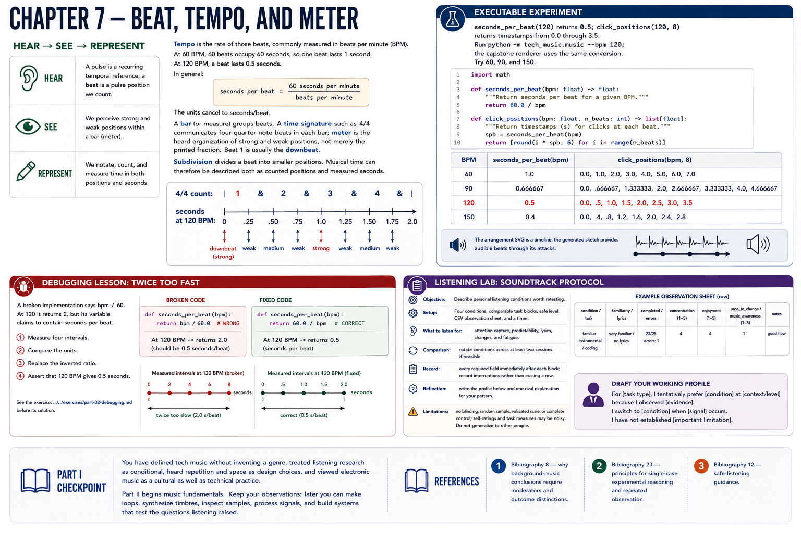

# Chapter 7 — Beat, Tempo, and Meter



## Hear → see → represent
A **pulse** is a recurring temporal reference; a **beat** is a pulse position we count. **Tempo** is the rate of those beats, commonly measured in beats per minute (**BPM**). At 60 BPM, 60 beats occupy 60 seconds, so one beat lasts 1 second. At 120 BPM, a beat lasts 0.5 seconds. In general:

```text
seconds per beat = 60 seconds per minute / beats per minute
```

The units cancel to seconds/beat. A **bar** (or measure) groups beats. A **time signature** such as 4/4 communicates four quarter-note beats in each bar; **meter** is the heard organization of strong and weak positions, not merely the printed fraction. Beat 1 is usually the **downbeat**. **Subdivision** divides a beat into smaller positions. Musical time can therefore be described both as counted positions and measured seconds.

```text
4/4 count: | 1  &  2  &  3  &  4  & |
seconds at 120 BPM: 0 .25 .50 .75 1.0 ...
```

## Executable experiment
`seconds_per_beat(120)` returns `0.5`; `click_positions(120, 8)` returns timestamps from `0.0` through `3.5`. Run `python -m tech_music.music --bpm 120`; the capstone renderer uses the same conversion. Try 60, 90, and 150. The arrangement SVG is a timeline; the generated sketch provides audible beats through its attacks.

## Debugging lesson: twice too fast
A broken implementation says `bpm / 60`. At 120 it returns `2`, but its variable claims to contain seconds per beat. Measure four intervals, compare the units, replace the inverted ratio, and assert that 120 BPM gives 0.5 seconds. See [the exercise](../../exercises/part-02-debugging.md) before its solution.

## Forward connection
Beat positions will become sequencer and MIDI event times; bars will become DAW timeline regions. The conversion is simple, but a unit error makes every later layer temporally wrong.

## References
Numbers refer to the [project bibliography](../../references/bibliography.md): Butler [19] on meter in electronic dance music; Laitz [24] on meter and notation; Python `wave` [1] for generated audio.
