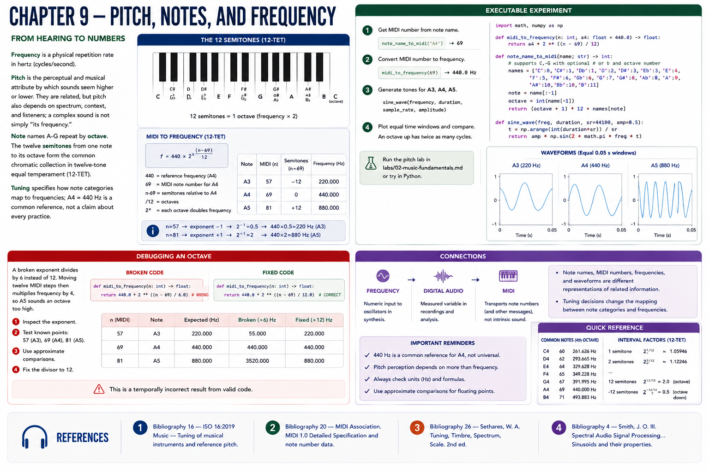

# Chapter 9 — Pitch, Notes, and Frequency



## From hearing to numbers
**Frequency** is a physical repetition rate in hertz (cycles/second). **Pitch** is the perceptual and musical attribute by which sounds seem higher or lower. They are related, but pitch also depends on spectrum, context, and listeners; a complex sound is not simply “its frequency.” Note names A–G repeat by **octave**. The twelve **semitones** from one note to its octave form the common chromatic collection in twelve-tone equal temperament (12-TET). **Tuning** specifies how note categories map to frequencies; A4 = 440 Hz is a common reference, not a claim about every practice.

For MIDI note number `n`:

```text
f = 440 × 2 ** ((n - 69) / 12)
```

`440` is the reference frequency; `69` is A4's MIDI number; subtracting 69 measures semitones from A4; dividing by 12 expresses octaves; raising 2 makes each octave a frequency doubling. Thus n=57 gives exponent −1 and 220 Hz; n=81 gives exponent +1 and 880 Hz.

## Executable experiment
`midi_to_frequency(69)`, `note_name_to_midi("A4")`, and then `midi_to_frequency(...)` expose both transformations. Generate A3, A4, and A5 with `sine_wave`, or run the [pitch lab](../../labs/02-music-fundamentals.md). Plot equal time windows: the octave-up waveform completes twice as many cycles. Note names, MIDI integers, frequencies, and waveforms are different representations of related information.

## Debugging an octave
A broken exponent divides by 6 rather than 12. Moving twelve MIDI steps then multiplies frequency by four, so A5 sounds an octave too high. Inspect the exponent, test 57/69/81, and use approximate floating-point comparisons rather than exact equality.

## Connections
Frequency becomes oscillator input in synthesis and a measured variable in digital audio. MIDI later transports note numbers, not an intrinsic sound.

## References
See the [bibliography](../../references/bibliography.md): ISO 16 [5] for the 440 Hz reference; MIDI Association [20] for MIDI note data; Sethares [26] on tuning, spectrum, and perception; Smith [4] on sinusoids.
