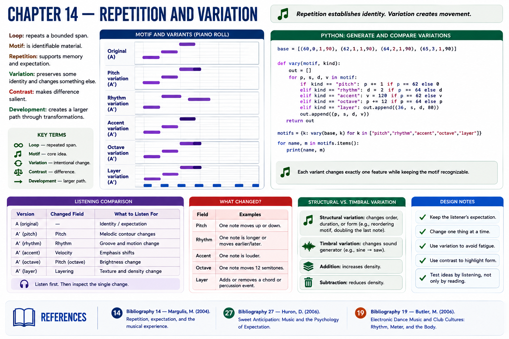

# Chapter 14 — Repetition and Variation

Part I treated repetition as a listening phenomenon. Composition turns it into a controllable relationship. A **loop** repeats a bounded span; a **motif** is identifiable material. Repetition supports memory and expectation, while **variation** preserves some identity and changes something else. **Contrast** makes difference salient; **development** creates a larger path through transformations.

> Repetition establishes identity. Variation creates movement.

This is a useful design principle, not a law. Music can resist identity or movement.

## Executable experiment
Copy a four-event motif into successive bars. Keep the original, then create independently labeled variants:

1. pitch: change one note;
2. rhythm: move or lengthen one event;
3. accent: change one velocity;
4. octave: add 12 to one pitch;
5. layer: add or subtract a chord or percussion event.

Render A–A–A′–A. Compare first without labels, then inspect the changed field. **Timbral variation** would change the sound generator; **structural variation** changes the order or duration of larger units. Addition and subtraction alter density.

Automated comparisons can prove that exactly one field changed. Listening asks the distinct question of whether identity remains perceptible.

## References
See the [bibliography](../../references/bibliography.md): Margulis [14] on repetition and musical experience; Huron [27] on expectation; Butler [19] on repetition and form in electronic dance music.
