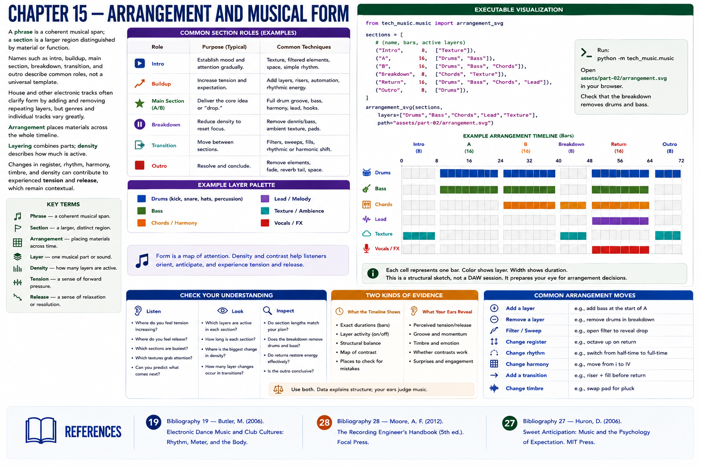

# Chapter 15 — Arrangement and Musical Form



A **phrase** is a coherent musical span; a **section** is a larger region distinguished by material or function. Names such as **intro**, **buildup**, **main section**, **breakdown**, **transition**, and **outro** describe common roles, not a universal template. House and other electronic tracks often clarify form by adding and removing repeating layers, but genres and individual tracks vary greatly.

**Arrangement** places materials across the whole timeline. **Layering** combines parts; **density** describes how much is active. Changes in register, rhythm, harmony, timbre, and density can contribute to experienced **tension** and **release**, which remain contextual.

```text
Intro      drums
A          drums + bass
B          drums + bass + chords
Breakdown  chords + texture
Return     drums + bass + chords + lead
Outro      drums
```

## Executable visualization
`arrangement_svg` accepts `(section name, bar count, active layers)` records. Colored cells show active layers; cell width shows duration. Run `python -m tech_music.music`, open `assets/part-02/arrangement.svg`, and check that the break removes drums and bass. This prepares the eye for DAW regions without yet teaching DAW operation.

A timeline reveals a duration error that listening may locate only approximately. Conversely, listening may reveal a transition that is technically aligned but perceptually abrupt. Use both forms of evidence.

## Part II destination
Continue to the [capstone lab](../../labs/03-part-02-capstone.md), where tempo, rhythm, pitch collections, bass, chords, motif, variation, and form become one inspectable sketch. Part III continues by turning this sketch into a complete track.

## References
See the [bibliography](../../references/bibliography.md): Butler [19] on electronic-dance form; Moore [28] on recorded-song arrangement; Huron [27] on expectation.
