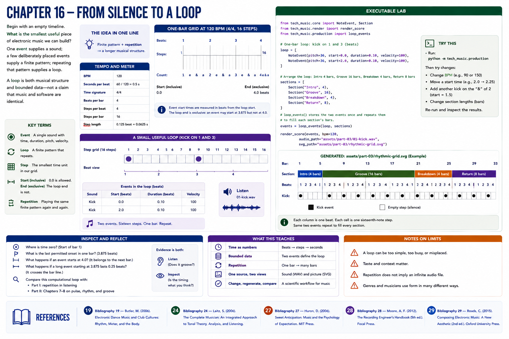

# Chapter 16 — From Silence to a Loop

Begin with an empty timeline. **What is the smallest useful piece of electronic music we can build?** One event supplies a sound; a few deliberately placed events supply a finite pattern; repeating that pattern supplies a loop. A loop is both musical structure and bounded data—not a claim that music and software are identical.

At 120 BPM, one beat lasts `60 / 120 = 0.5` seconds. In 4/4, a one-bar loop has four beats. Dividing each beat into four produces sixteen steps; valid event starts are measured in beats from the inclusive start boundary, while the loop end is exclusive. `loop_events()` stores events once and the renderer repeats them through arrangement bars.

## Executable lab
Run `python -m tech_music.production`, inspect `assets/part-03/rhythmic-grid.svg`, and play `01-kick.wav`. Change `BPM`, an event start, or a section's bars, regenerate, and record the result. The same score data drives sound and picture: **finite pattern + repetition → a longer musical structure**. Finite data is easy to validate, transform, copy, and visualize; repetition need not imply an infinite audio file.

## Inspect and reflect
Locate time zero, the final permitted onset, and the loop boundary. What changes when the last event extends across it? Compare this computational loop with Part I's cautious discussion of repetition and Part II Chapters 7–8.

## References
See the [project bibliography](../../references/bibliography.md): Butler [19] for rhythm, meter, and form in electronic dance music; Laitz [24] for music terminology; Huron [27] for expectation; Moore [28] for recorded-song layers and arrangement; and Roads [29] for computer-music sequencing and synthesis terminology. Claims here are deliberately limited to what those sources support.
