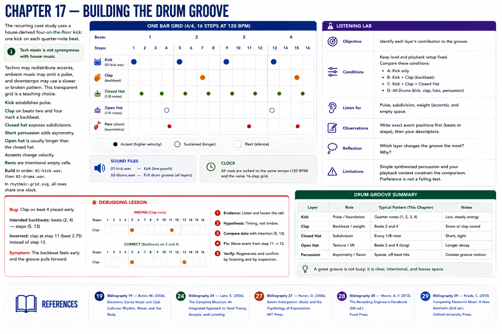

# Chapter 17 — Building the Drum Groove

The recurring case study uses a house-derived four-on-the-floor kick: one kick on each quarter-note beat. **Tech music is not synonymous with house music.** Techno may redistribute accents, ambient music may omit a pulse, and downtempo may use a slower or broken pattern. This transparent grid is a teaching choice.

The kick establishes pulse; claps on beats two and four mark a backbeat; closed hats expose subdivisions; short percussion adds asymmetry. An open hat would usually be longer than the closed hat. Accents change velocity; rests are intentional empty cells. Build in order: `01-kick.wav`, then `02-drums.wav`. In `rhythmic-grid.svg`, all rows share one clock.

## Listening lab
**Objective:** identify each layer's contribution. **Conditions:** fixed level and playback setup; compare kick, kick+clap (temporarily filter the score), kick+clap+hat, and all drums. **Listen for:** pulse, subdivision, weight, and empty space. **Observations:** write event positions before adjectives. **Reflection:** which layer changes the groove most? **Limitations:** simple synthesized percussion and your playback context constrain the comparison; preference is not a failing test.

## Debugging lesson
Move the second clap from beat 3 to 2.75. **Symptom:** the backbeat seems early. **Evidence:** listen, then locate the cell. **Hypothesis:** timing, not timbre. Compare the event data with the intended beats `(1, 3)`, fix it, regenerate, and verify by both methods.

## References
See the [project bibliography](../../references/bibliography.md): Butler [19] for rhythm, meter, and form in electronic dance music; Laitz [24] for music terminology; Huron [27] for expectation; Moore [28] for recorded-song layers and arrangement; and Roads [29] for computer-music sequencing and synthesis terminology. Claims here are deliberately limited to what those sources support.
