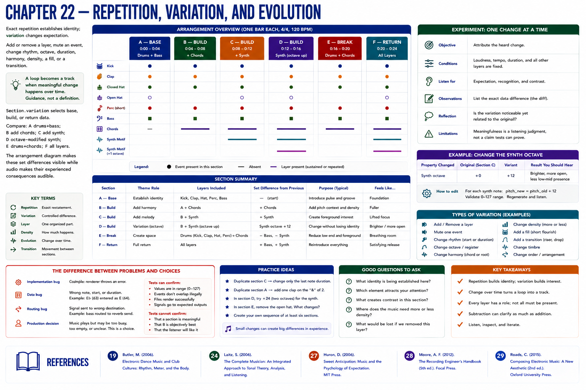

# Chapter 22 — Repetition, Variation, and Evolution

Exact repetition establishes identity; variation changes expectation. Add or remove a layer, mute an event, change rhythm, octave, duration, harmony, density, a fill, or a transition. A useful production principle is: **a loop becomes a track when meaningful change happens over time**. It is guidance, not a universal definition.

`Section.variation` selects base, build, or return data. Compare: A drums+bass; B add chords; C add synth; D octave-modified synth; E drums+chords; F all layers. The arrangement diagram makes these set differences visible while audio makes their experienced consequences audible.

## Experiment
Duplicate a section and alter exactly one property. **Objective:** attribute the heard change. **Conditions:** loudness and duration fixed. **Listen for:** expectation and recognition. **Observations:** list the data diff. **Reflection:** is the variation noticeable yet related? **Limitations:** meaningfulness remains a listening judgment, not an assertion tests can prove.

## References
See the [project bibliography](../../references/bibliography.md): Butler [19] for rhythm, meter, and form in electronic dance music; Laitz [24] for music terminology; Huron [27] for expectation; Moore [28] for recorded-song layers and arrangement; and Roads [29] for computer-music sequencing and synthesis terminology. Claims here are deliberately limited to what those sources support.
