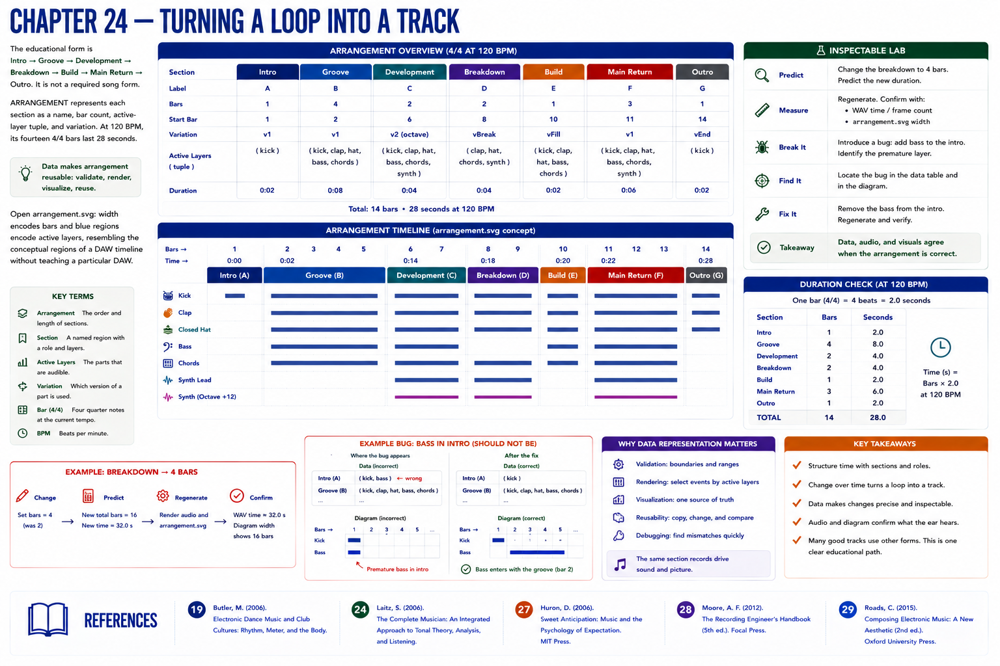

# Chapter 24 — Turning a Loop into a Track

The educational form is Intro → Groove → Development → Breakdown → Build → Main Return → Outro. It is not a required song form. `ARRANGEMENT` represents each section as a name, bar count, active-layer tuple, and variation. At 120 BPM its fourteen 4/4 bars last 28 seconds.

Data makes arrangement reusable: validation computes boundaries, rendering selects layers, and SVG generation draws the same section records. Open `arrangement.svg`: width encodes bars and blue regions encode active layers, resembling the conceptual regions of a DAW timeline without teaching a particular DAW.

## Inspectable lab
Change the breakdown to four bars. Predict duration, regenerate, and confirm both WAV frame count and diagram width. Then introduce an arrangement bug by adding bass to the intro, identify the premature layer in data and image, restore it, and verify.

Part IV will show how a DAW offers graphical timeline workflows related to this computational one. Parts IX–X later examine and implement the software architecture behind sequencing tools.

## References
See the [project bibliography](../../references/bibliography.md): Butler [19] for rhythm, meter, and form in electronic dance music; Laitz [24] for music terminology; Huron [27] for expectation; Moore [28] for recorded-song layers and arrangement; and Roads [29] for computer-music sequencing and synthesis terminology. Claims here are deliberately limited to what those sources support.
