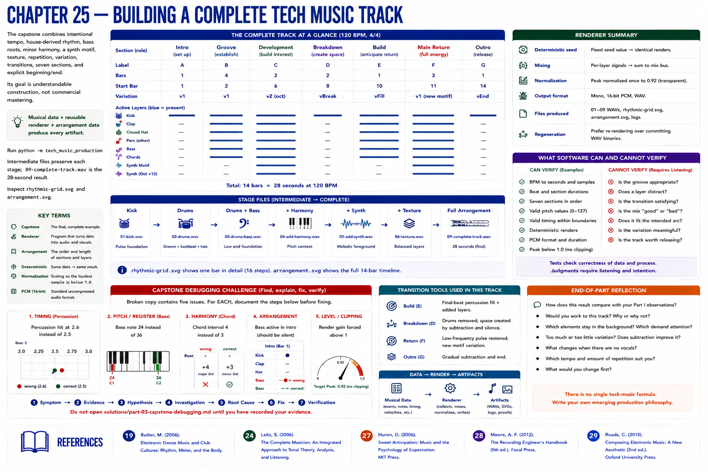

# Chapter 25 — Building a Complete Tech Music Track

The capstone combines intentional tempo, house-derived rhythm, bass roots, minor harmony, a synth motif, texture, repetition, variation, transitions, seven sections, and explicit beginning/end. Its goal is **understandable construction**, not commercial mastering. Musical data + reusable renderer + arrangement data produce every artifact.

Run `python -m tech_music.production`. Intermediate files preserve kick, drums, drums+bass, harmony, synth, and texture stages; `09-complete-track.wav` is the 28-second result. Inspect `rhythmic-grid.svg` and `arrangement.svg`. The renderer deterministically seeds noise, mixes event signals, applies one transparent peak normalization to 0.92, and writes mono 16-bit PCM. Regeneration is preferred to committing WAV binaries.

## Capstone debugging challenge
A broken copy contains: percussion at 2.6 rather than 2.5 (timing); bass 24 rather than 36 (pitch/register); chord interval 4 rather than 3 (harmony); bass active in intro (arrangement); and render gain forced above 1 (level/clipping). For **each**, document: **Symptom → Evidence → Hypothesis → Investigation → Root Cause → Fix → Verification**. Do not open the [solutions](../../solutions/part-03-capstone-debugging.md) until recording evidence.

## What software can and cannot verify
Tests verify BPM conversion, beat/section duration, seven sections, valid pitch/timing, boundaries, deterministic samples, PCM duration, and peak below one. They cannot decide whether a groove feels appropriate, a layer distracts, or a transition is satisfying. Those require listening and an explicit production intention.

## End-of-Part reflection
Compare this result with your Part I observations. Would you work to it? Which elements stay background or demand attention? Too much or too little variation? Does subtraction improve it? What changes without vocals? Which tempo and amount of repetition suit you? What would you change? There is no single tech-music formula; write your own emerging production philosophy.

Next, and not begun here, Part IV asks what software environment musicians use to organize related timeline work. Part V explains synthesis; VI audio representation; VII mathematical transformations; VIII MIDI; IX–X system architecture and implementation.

## References
See the [project bibliography](../../references/bibliography.md): Butler [19] for rhythm, meter, and form in electronic dance music; Laitz [24] for music terminology; Huron [27] for expectation; Moore [28] for recorded-song layers and arrangement; and Roads [29] for computer-music sequencing and synthesis terminology. Claims here are deliberately limited to what those sources support.
