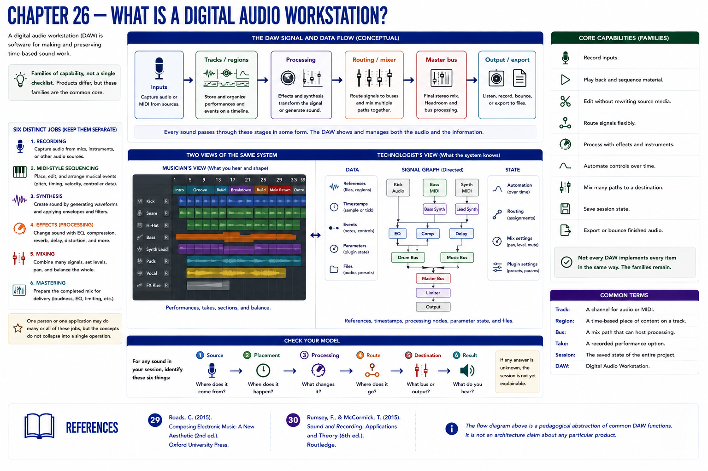
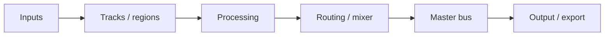

# Chapter 26 — What Is a Digital Audio Workstation?

A **digital audio workstation (DAW)** is software for making and preserving time-based sound work. It can record inputs, play material, sequence events, edit without rewriting source media, route signals, process them, automate controls, mix many paths, save session state, and export audio. These are families of capability, not a checklist shared identically by every product.

Keep six jobs distinct. **Recording** captures audio; **MIDI-style sequencing** schedules editable musical events; **synthesis** produces sound; **effects** transform a signal; **mixing** combines and balances paths; **mastering** prepares a completed mix for delivery. One person or application may combine them, but the concepts do not collapse into one operation.

A DAW exposes two views of the same system: a musician sees performances, takes, sections, and balance; a technologist sees references, timestamps, processing nodes, a directed signal graph, parameter state, and files. Part III's arrangement already contained these ingredients. Part IV gives them a session-shaped home.

## Check your model
For any sound, identify its source, placement, processing, route, and destination. If one is unknown, the session is not yet explainable.

## References
See the [bibliography](../../references/bibliography.md): Roads [29] for computer-music terminology and Rumsey and McCormick [30] for recording-system signal flow. The diagram is a pedagogical abstraction, not an Ardour architecture claim.
