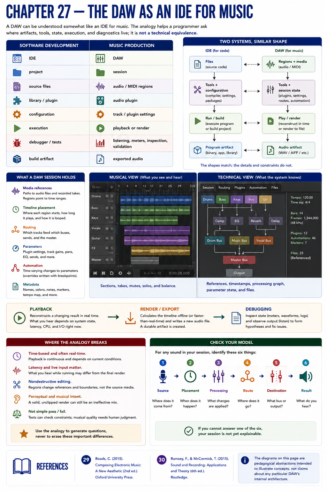
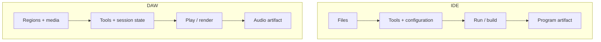

# Chapter 27 — The DAW as an IDE for Music

A DAW can be understood **somewhat like an IDE for music**. The analogy helps a programmer ask where artifacts, tools, state, execution, and diagnostics live; it is not a technical equivalence.

| Software development | Music production |
|---|---|
| IDE | DAW |
| project | session |
| source files | audio/MIDI regions |
| library/plugin | audio plugin |
| configuration | track/plugin settings |
| execution | playback or render |
| debugger/tests | listening, meters, inspection, validation |
| build artifact | exported audio |

A session usually refers to media as well as storing timeline placement, routes, parameters, and automation. Playback reconstructs a time-varying result; export creates a durable artifact. Debugging similarly combines state inspection with observing output.

## Where the Analogy Breaks

* Playback is time-based and commonly real-time; audio processing can be continuous.
* Latency and a live input can change the experience while the system runs.
* Nondestructive region editing changes references and boundaries, unlike rewriting source text.
* Perceptual correctness and musical intention matter. A valid, unclipped render can still be an ineffective mix.
* A test often has a discrete expectation; musical quality is not reducible to pass/fail.

Use the analogy to generate questions, never to erase these differences.

## References
See Rumsey and McCormick [30] for studio workflows, Roads [29] for computer-music systems, and the [research note](../../references/source-notes/part-04.md) for the limits placed on Ardour-specific claims.
