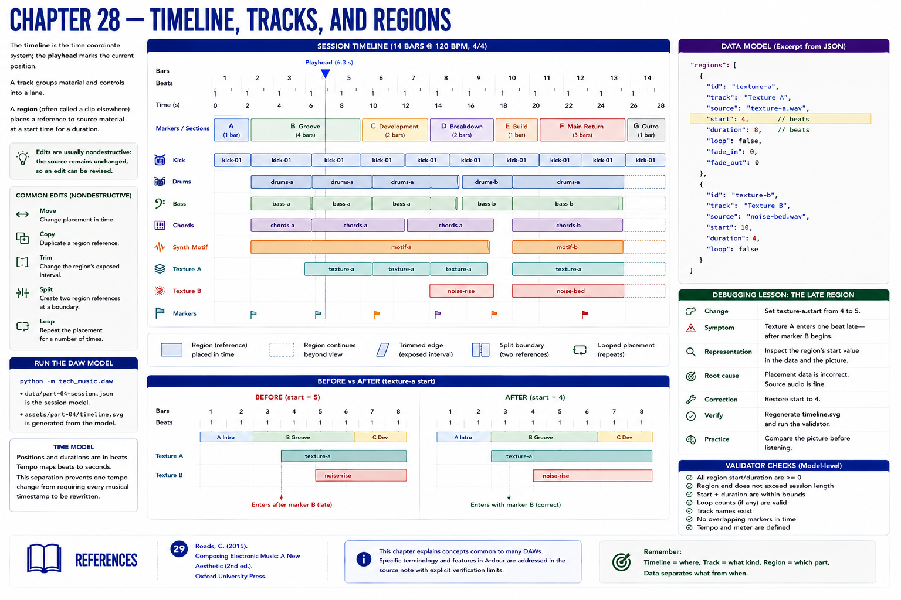

# Chapter 28 — Timeline, Tracks, and Regions



The **timeline** is the time coordinate system; the **playhead** marks the current position. A **track** groups material and controls into a lane. A **region** (often called a clip elsewhere) places a reference to source material at a start time for a duration.

Moving or copying changes placement. Trimming changes which interval is exposed. Splitting makes two region references at a boundary. Looping repeats a placement. These operations can be **nondestructive**: the source remains unchanged, so an edit can be revised.

Part III's sections map to markers, its layers to tracks, and its events to regions. Run:

```bash
python -m tech_music.daw
```

`data/part-04-session.json` is the model and `assets/part-04/timeline.svg` is generated from it. Positions and durations are in beats; tempo maps beats to seconds. This separation prevents one tempo change from requiring every musical timestamp to be rewritten.

## Debugging lesson: the late region

Change `texture-a.start` from `4` to `5`. **Symptom:** texture enters a beat after marker B. **Representation:** inspect the region's `start`. **Root cause:** placement data, not source audio. **Correction:** restore `4`, regenerate the timeline, and run the validator. Compare the picture before listening.

## References
See Roads [29] for sequencing concepts. Ardour-specific verification remains explicitly limited in the [source note](../../references/source-notes/part-04.md).
