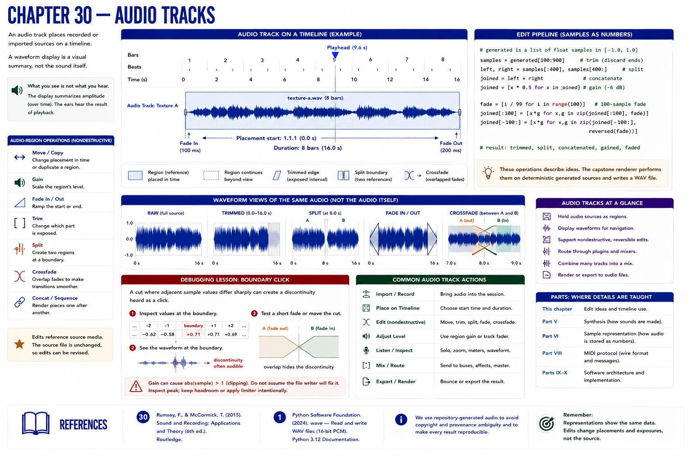

# Chapter 30 — Audio Tracks



An audio track places recorded or imported sources on a timeline. A waveform display is a visual summary, not the sound itself. Region gain scales a placement; fades ramp its edges; trimming changes the exposed range; splitting makes editable pieces; concatenation renders pieces in sequence. A crossfade overlaps complementary fades to make a transition less abrupt.

Using repository-generated audio avoids copyright and provenance ambiguity. A minimal edit pipeline is:

```python
samples = generated[100:900]       # trim
left, right = samples[:400], samples[400:]  # split
joined = left + right              # concatenate
joined = [x * 0.5 for x in joined] # gain
fade = [i / 99 for i in range(100)]
joined[:100] = [x*g for x,g in zip(joined[:100], fade)]
joined[-100:] = [x*g for x,g in zip(joined[-100:], reversed(fade))]
```

The capstone renderer performs these ideas on deterministic generated sources and writes a waveform-compatible WAV. Part VI will explain sample representation; this chapter treats samples only as editable signal values.

## Debugging lesson: boundary click
A cut where adjacent sample values differ sharply can create a discontinuity heard as a click. Inspect values and waveform at the boundary; test a short fade or choose a nearby quiet crossing. Separately, gain can cause `abs(sample) > 1`; do not disguise that fault by assuming the file writer will fix it.

## References
See Rumsey and McCormick [30] for practical digital recording/editing and Python's inspected `wave` documentation [1] for the repository's PCM file interface.
