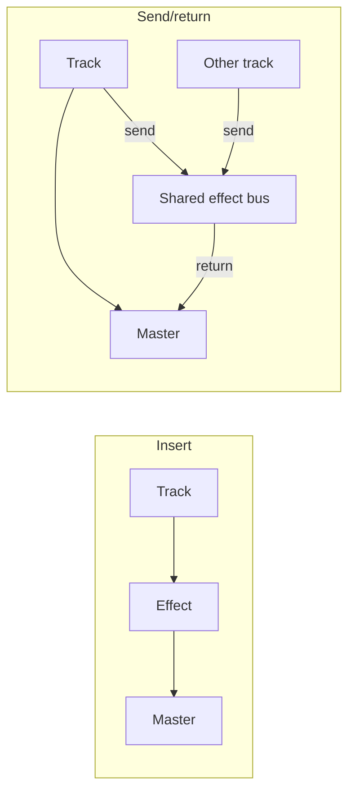

# Chapter 32 — Buses, Sends, and Returns

An **insert** puts an effect directly in a track's serial path. A **send/return** creates a parallel branch to shared processing. With reverb, the direct path is **dry** and the return is **wet**. Many tracks can feed one effect bus, then one bus/return level controls their combined processed contribution.

Why share? It reduces duplicated state and lets several sounds inhabit a related space. It does not make all sends identical: each send level controls contribution, the bus controls processing, and the return controls wet level.

## Listening experiment
`python -m tech_music.daw` renders dry signals plus a deliberately tiny delayed copy standing in for a spacious effect. Set `shared-delay.parameters.mix` to `0` (dry), then `0.18` (shared wet path). An inserted version would blend the delayed copy before only one track reaches the master. Match loudness before judging; “more effect” can also mean “louder.” This is not a realistic reverb algorithm.

## References
See Rumsey and McCormick [30] for console buses/auxiliary paths.
