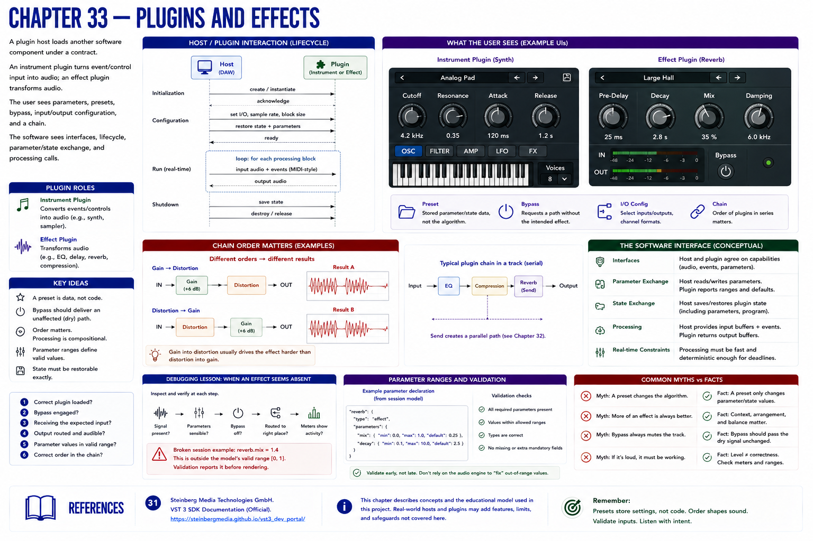
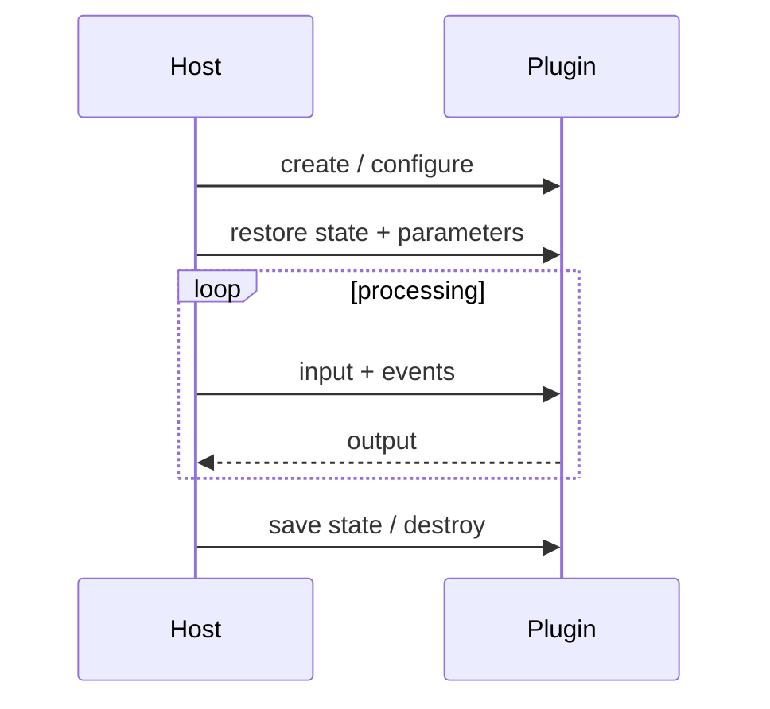

# Chapter 33 — Plugins and Effects

A **plugin host** loads another software component under a contract. An instrument plugin turns event/control input into audio; an effect plugin transforms audio. The user sees parameters, presets, bypass, input/output configuration, and a chain. The software sees interfaces, lifecycle, parameter/state exchange, and processing calls.

A preset is stored parameter/state data, not the algorithm. **Bypass** asks for a path without the intended effect. Chain order matters because processing is compositional: gain into distortion generally differs from distortion into gain.

## Debugging lesson
If an effect seems absent, inspect: correct plugin, bypass, input, output, parameter range, and order. The broken session supplies `mix=1.4`, outside the model's `[0,1]` contract. Validation reports it before rendering. Unexpected gain accumulation needs meters and per-stage comparison, not preset swapping.

This chapter does not implement a plugin API. Part VII studies transformations; Parts IX–X can examine hosting and real-time contracts.

## References
See Steinberg's official VST 3 developer documentation [31] for a concrete host/plugin contract.
