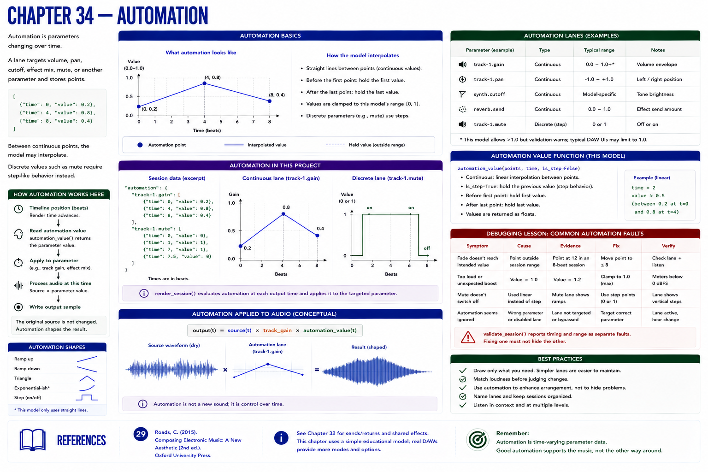

# Chapter 34 — Automation



Automation is **parameters changing over time**. A lane targets volume, pan, cutoff, effect mix, mute, or another parameter and stores points such as:

```json
[{"time": 0, "value": 0.2}, {"time": 4, "value": 0.8}, {"time": 8, "value": 0.4}]
```

Between continuous points, the model may interpolate. `automation_value()` uses straight lines and holds the first/last values outside their range. Discrete values such as mute require step-like behavior instead. A real DAW's modes and interpolation rules are implementation-specific.

`render_session()` evaluates `track-id.gain` for each output time. The original source is unchanged; the resulting envelope is source amplitude multiplied by track gain and automation value. The timeline SVG and JSON let the reader inspect the same timing coordinate used by rendering.

## Debugging lesson
A point at beat 12 in an eight-beat session cannot cause the intended beat-eight fade. A value of `1.2` violates this model's normalized range. `validate_session()` reports timing and range as separate faults. Fixing one must not conceal the other.

## References
See Roads [29] for time-varying computer-music control.
