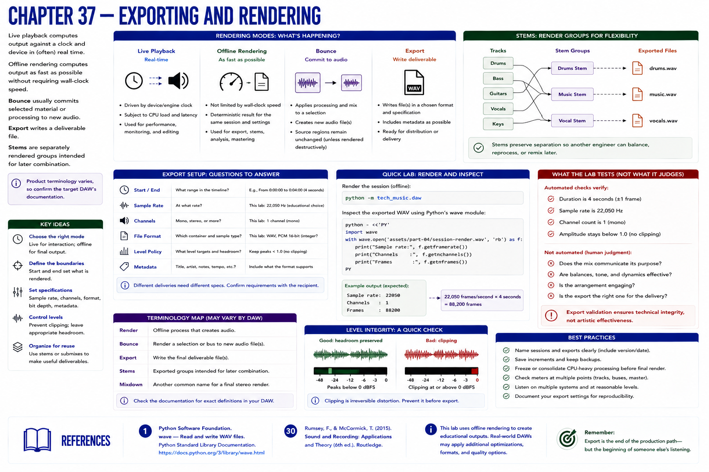

# Chapter 37 — Exporting and Rendering



**Live playback** computes output against a clock and device. **Offline rendering** computes without requiring wall-clock speed. **Bounce** usually commits selected material or processing to new audio. **Export** writes a deliverable. **Stems** are separately rendered groups intended for later combination. Product terminology varies, so confirm the target DAW's documentation.

Before export, specify start/end boundaries, sample rate, channel count, file format, level policy, and metadata needs. This lab writes mono PCM WAV at 22,050 Hz for compact education, not as a universal delivery recommendation.

```bash
python -m tech_music.daw
python - <<'PY'
import wave
with wave.open('assets/part-04/session-render.wav') as f:
    print(f.getframerate(), f.getnchannels(), f.getnframes())
PY
```

Tests verify four seconds, the declared rate, one channel, and amplitude below one. Export validation cannot decide whether the mix communicates its purpose.

## References
See Python `wave` documentation [1], Rumsey and McCormick [30].
