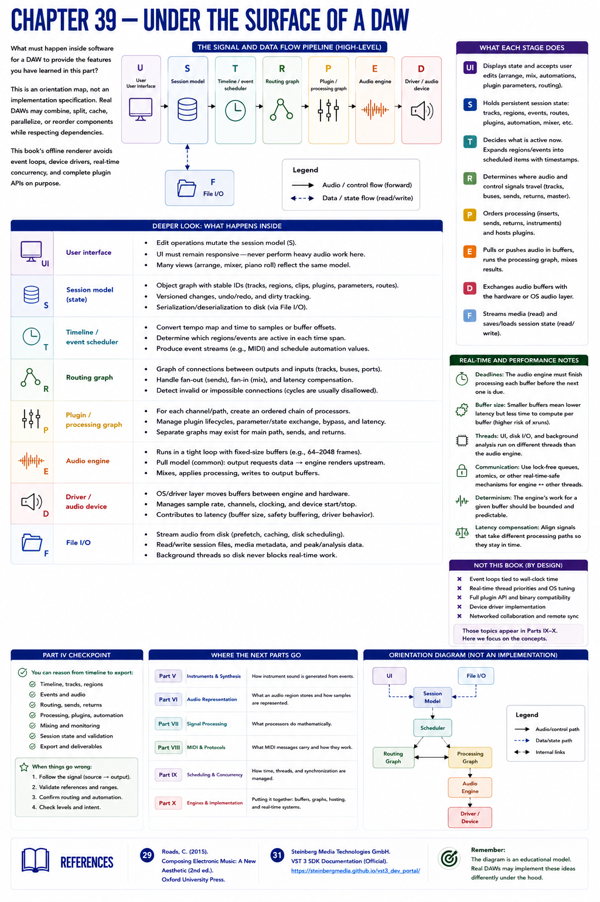
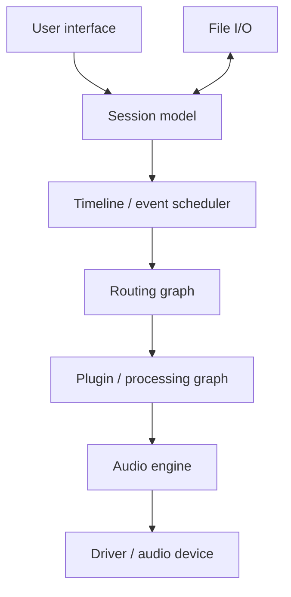

# Chapter 39 — Under the Surface of a DAW

What must happen inside software for a DAW to provide these features?

The UI edits persistent state. A scheduler decides which regions/events are active. Routing and processing graphs determine order and destinations. An audio engine repeatedly fills buffers; drivers exchange buffers with a device. Plugin hosting coordinates external code. File I/O streams media and saves state. Threads must communicate without making time-critical processing miss deadlines; buffer size contributes to latency.

This is an orientation map, not an implementation specification. Actual DAWs may merge, split, cache, parallelize, or reorder components while respecting dependencies. This part's offline renderer avoids event loops, device drivers, real-time concurrency, and complete plugin APIs on purpose.

The questions lead forward: Part V asks what produces instrument sound; Part VI what an audio region stores; Part VII what processors do mathematically; Part VIII what MIDI carries; Parts IX–X how scheduling, buffers, graphs, plugins, and engines can be designed.

## Part IV checkpoint
You can reason from timeline to tracks, regions, events/audio, routing, plugins, automation, mixing, state, and export. For silence, follow the signal. For bad state, validate references. For valid but ineffective output, listen against intent.

## References
See Roads [29], Steinberg VST 3 documentation [31]. The diagram is not claimed to reproduce Ardour's implementation.
