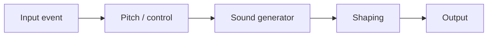

# Chapter 40 — What Is a Synthesizer

A synthesizer is an instrument **and** a signal-generating system. An input event does not contain sound: it supplies intent—note, velocity, and perhaps controllers. A sound generator creates a signal; envelopes, filters, amplifiers, mixers, modulation, and effects shape it.

Hardware synthesizers package controls and sound electronics in a physical instrument; software synthesizers run the corresponding signal and state models in a computer. Either may be monophonic (one note at a time) or polyphonic (several voices). **Subtractive** synthesis filters a rich source; **additive** synthesis sums components; **FM** changes an oscillator's frequency with another oscillator; **wavetable** synthesis reads stored single-cycle shapes; sampling-based instruments play recordings. These are families, not mutually exclusive product labels.

A useful inspection order is **hear → visualize → explain → modify → implement → debug**. A mathematically valid signal, correct program, useful musical gesture, and personally pleasing sound are four different judgments.

## References
See Roads [29] and Smith [4].
