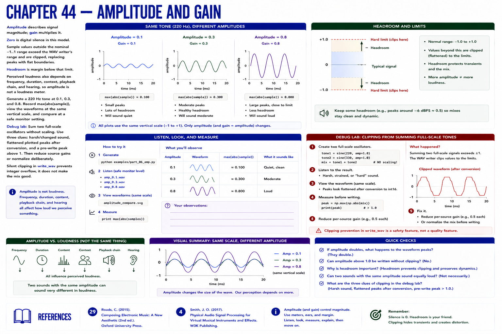

# Chapter 44 — Amplitude and Gain

Amplitude describes signal magnitude; gain multiplies it. Zero is digital silence in this model. Sample values outside the nominal −1..1 range exceed the WAV writer's range and are clipped, replacing peaks with flat boundaries. **Headroom** is margin below that limit. Perceived loudness also depends on frequency, duration, context, playback chain, and hearing, so amplitude is not a loudness meter.

Generate a 220 Hz tone at 0.1, 0.3, and 0.8. Record `max(abs(sample))`, view the waveforms at the same vertical scale, and compare at a safe monitor setting.

**Debug lab.** Sum two full-scale oscillators without scaling. Use three clues: harsh/changed sound, flattened plotted peaks after conversion, and a pre-write peak above 1. Then reduce source gains or normalize deliberately. Silent clipping in `write_wav` prevents integer overflow; it does not make the mix good.

## References
See Roads [29] and Smith [4].
