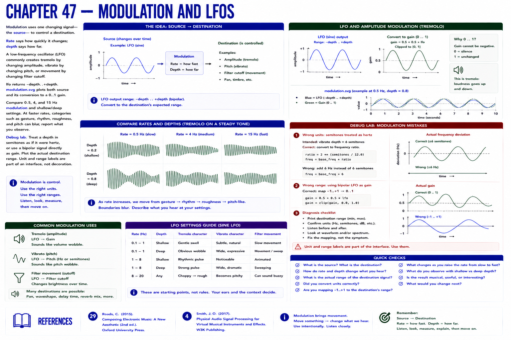

# Chapter 47 — Modulation and LFOs

Modulation uses one changing signal—the **source**—to control a **destination**. Rate says how quickly it changes; depth says how far. A low-frequency oscillator (LFO) commonly creates tremolo by changing amplitude, vibrato by changing pitch, or movement by changing filter cutoff.

`lfo` returns −depth..+depth. `modulation.svg` plots both source and its conversion to a 0..1 gain. Compare 0.5, 4, and 15 Hz modulation and shallow/deep settings. At faster rates, categories such as gesture, rhythm, roughness, and pitch can blur; report what you observe.

**Debug lab.** Treat a depth in semitones as if it were hertz, or use a bipolar signal directly as gain. Plot the actual destination range. Unit and range labels are part of an interface, not decoration.

## References
See Roads [29] and Smith [4].
