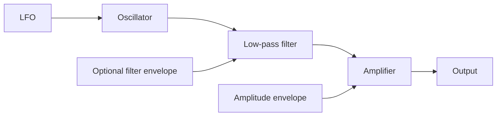

# Chapter 49 — Subtractive Synthesis

Subtractive synthesis begins with spectrally rich material and removes or attenuates portions with a filter.

The educational voice composes waveform selection, note-derived pitch, optional pitch LFO, ADSR multiplication, and a one-pole low-pass. Read `render_note` in `src/tech_music/synth.py`; change one parameter at a time in the JSON patch. A production synth may order or implement these blocks differently.

**Lab.** Render saw at cutoffs 400, 1,200, and 5,000 Hz, then compare attack settings. This separates source, spectral shaping, and articulation. A filter envelope is an extension exercise: map a control curve into a validated cutoff range.

## References
See Roads [29] and Smith [4].
