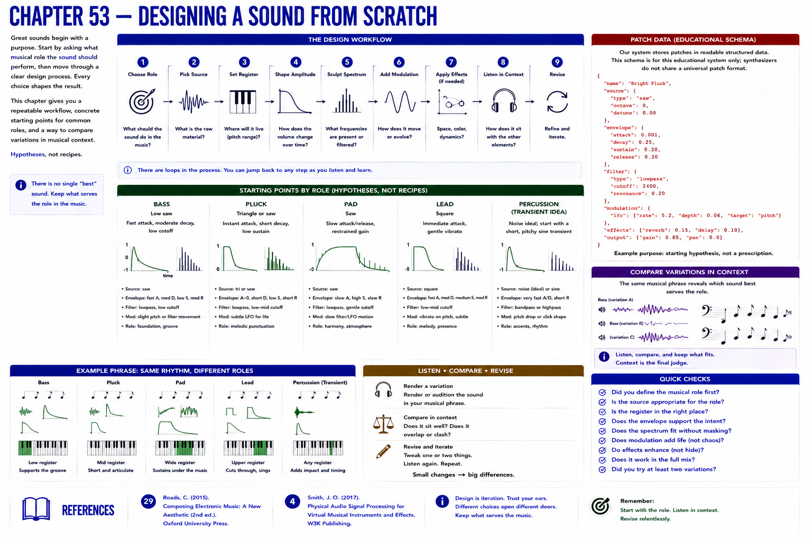

# Chapter 53 — Designing a Sound from Scratch

Ask first: **what musical role should this sound perform?** Then (1) choose role, (2) source, (3) register, (4) amplitude shape, (5) spectrum, (6) modulation, (7) effects if needed, (8) listen in context, and (9) revise.

Try these starting points: bass—low saw, fast attack, moderate decay, low cutoff; pluck—triangle/saw, instant attack, short decay, low sustain; pad—saw, slow attack/release, restrained gain; lead—square, immediate attack, gentle vibrato; percussion—noise would be ideal, but the current schema can teach a short, pitchy sine transient. These are hypotheses, not recipes.

`data/part-05-patch.json` is readable structured patch data. Its schema belongs only to this educational system; synthesizers do not share a universal patch schema. Render variations, label them, compare within a musical phrase, and keep what serves the role.

## References
See Roads [29] and Smith [4].
