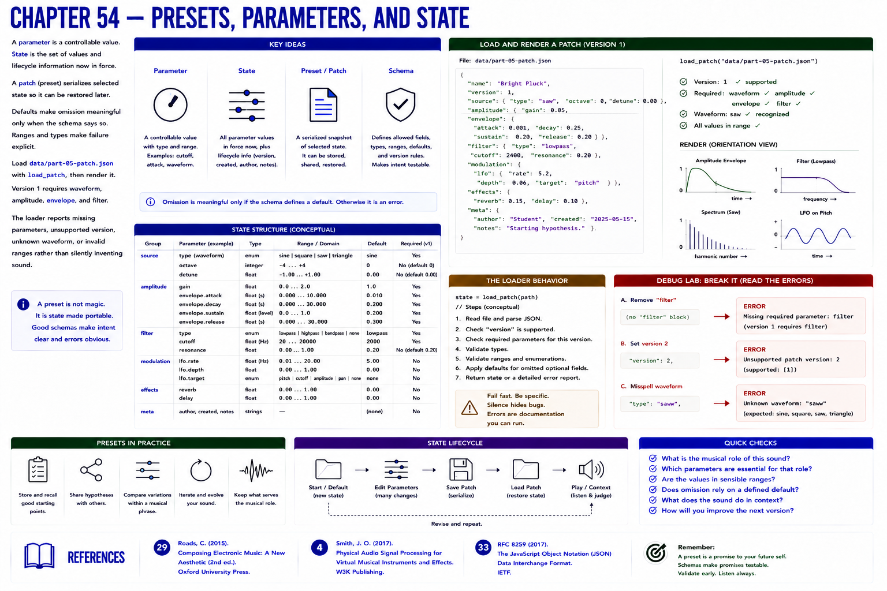

# Chapter 54 — Presets, Parameters, and State

A **parameter** is a controllable value; **state** is the set of values and lifecycle information now in force. A patch/preset serializes selected state so it can be restored. Defaults make omission meaningful only when the schema says so. Ranges and types make failure explicit.

Load `data/part-05-patch.json` with `load_patch`, then render it. Version 1 requires waveform, amplitude, envelope, and filter. The loader reports missing parameters, unsupported version, unknown waveform, or invalid ranges rather than silently inventing sound.

**Debug lab.** Remove `filter`, set version 2, and misspell `saw` in separate copies. Read each error. Validation is executable documentation and protects downstream DSP assumptions.

## References
See Roads [29] and RFC 8259 [33] where JSON serialization is discussed.
