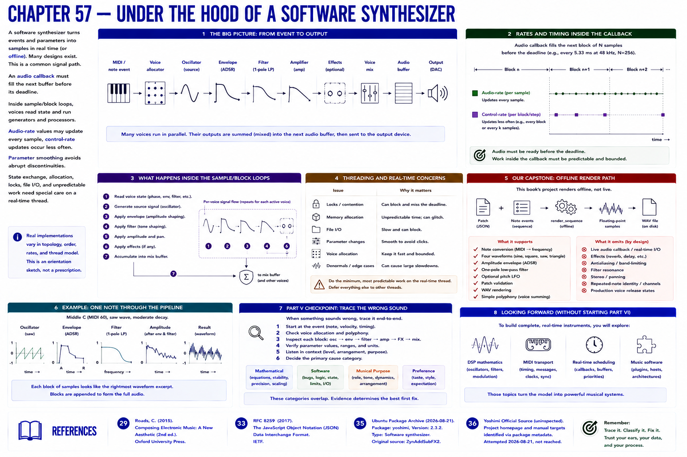
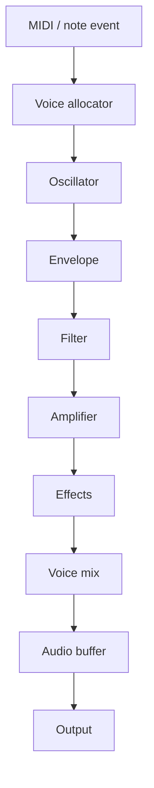

# Chapter 57 — Under the Hood of a Software Synthesizer

Real implementations vary. An audio callback must fill the next buffer before its deadline. Inside sample/block loops, voices read state and compose generators and processors. **Audio-rate** values may update every sample; cheaper **control-rate** updates occur less often. Parameter smoothing avoids abrupt discontinuities. State exchange, allocation, locks, file I/O, and unpredictable work need special care on a real-time thread.

Our capstone is offline: **patch + note events → `render_sequence` → floating samples → WAV**. It supports note conversion, four waveforms, amplitude, ADSR, one-pole filtering, optional pitch LFO, patch validation, WAV rendering, and simple polyphony. It omits live MIDI/audio callbacks, effects, antialiasing, resonance, stereo, repeated-note identity, and production voice release state.

That boundary points forward without beginning Part VI: what are these samples? Later parts address DSP mathematics, MIDI transport, real-time scheduling, and fuller music software.

## Part V checkpoint
Trace a wrong sound from event through control values and every signal block. Decide whether evidence shows a mathematical, software, musical-purpose, or preference issue. Those categories overlap, but they are not identical.

## References
See Roads [29] and RFC 8259 [33] where JSON serialization is discussed.
