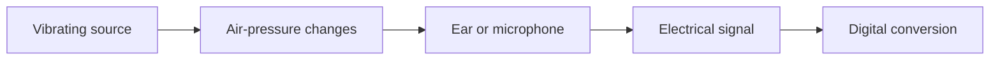

# Chapter 58 — What Is Sound?

A vibrating source disturbs a **medium**. In air, alternating local **compressions** and **rarefactions** create acoustic-pressure variation around atmospheric pressure. That physical propagation is sound; it needs a source, medium, and potential listener, but not a computer.

A microphone is a transducer: it makes an electrical audio signal related to pressure at its diaphragm. That changing voltage represents sound but is not air pressure. An ADC can represent the signal as numbers. Digital audio data is neither pressure nor voltage; metadata gives the numbers meaning. A speaker reverses part of the chain by converting an electrical signal to motion and pressure variation.

**Vocabulary check:** sound is the physical event; acoustic pressure is a measurable physical quantity; an analog electrical signal varies continuously in the educational model; digital data is discrete encoded information. See Part V's oscillators for generated representations and Chapter 72 for the return path.

## References

- Curtis Roads, *The Computer Music Tutorial*, 2nd ed. (MIT Press, 2023), [bibliography §29](../../references/bibliography.md#29).
- Julius O. Smith III, *Mathematics of the DFT*, 2nd ed. (2007), [bibliography §4](../../references/bibliography.md#4).
- Additional chapter-specific standards and official documentation are indexed in the [Part VI sources](../../references/bibliography.md#part-vi-sources).
