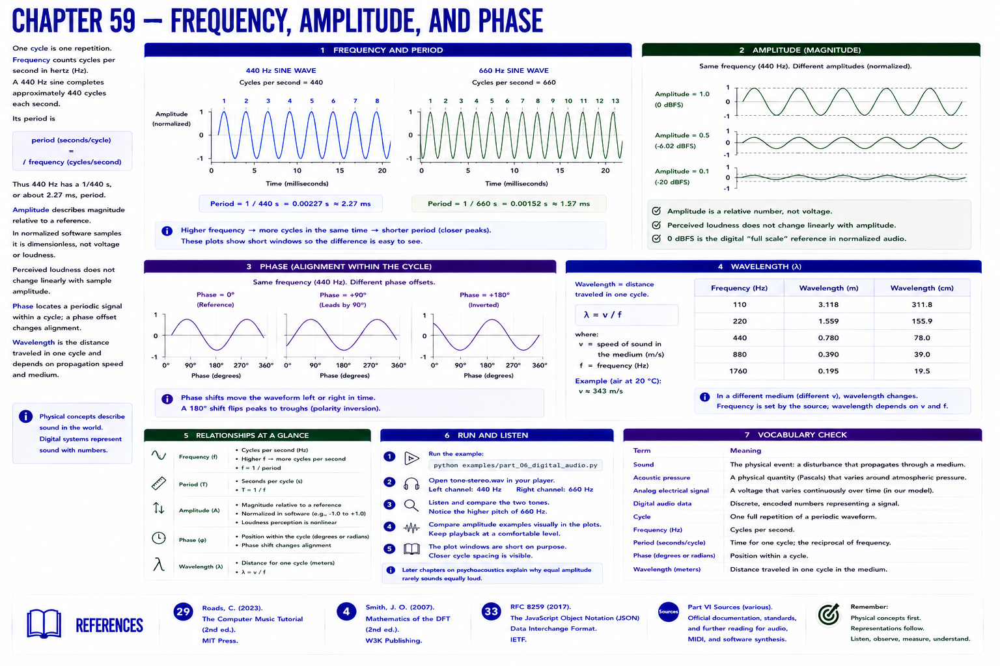

# Chapter 59 — Frequency, Amplitude, and Phase

One **cycle** is one repetition. **Frequency** counts cycles per second in hertz (Hz), so a 440 Hz sine completes approximately 440 cycles each second. Its **period** is

`period (seconds/cycle) = 1 / frequency (cycles/second)`.

Thus 440 Hz has a 1/440 s, or about 2.27 ms, period. **Amplitude** describes magnitude relative to a reference. In normalized software samples it is dimensionless, not voltage or loudness. Perceived loudness does not change linearly with sample amplitude. **Phase** locates a periodic signal within a cycle; a phase offset changes alignment. Wavelength is the distance traveled in one cycle and depends on propagation speed and medium.

## Run and listen

Run `python examples/part_06_digital_audio.py`. Compare the 440 and 660 Hz channels in `tone-stereo.wav`, then compare conservative amplitude examples visually. Keep playback at a comfortable level. The plot uses short windows so closer cycle spacing is visible. Later psychoacoustics will separate physical magnitude from perception.

## References

- Curtis Roads, *The Computer Music Tutorial*, 2nd ed. (MIT Press, 2023), [bibliography §29](../../references/bibliography.md#29).
- Julius O. Smith III, *Mathematics of the DFT*, 2nd ed. (2007), [bibliography §4](../../references/bibliography.md#4).
- Additional chapter-specific standards and official documentation are indexed in the [Part VI sources](../../references/bibliography.md#part-vi-sources).
