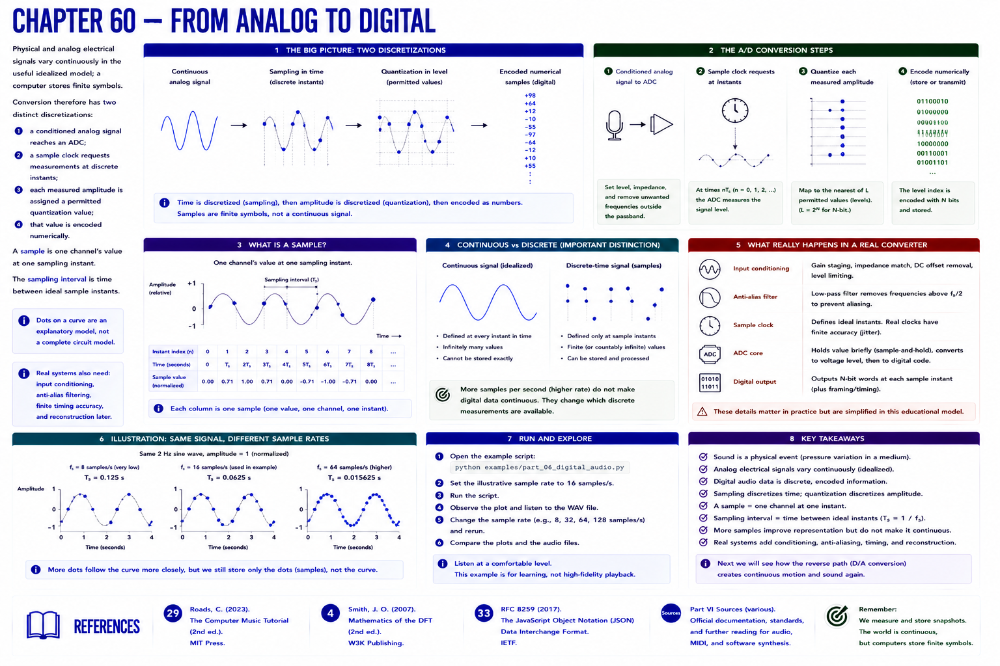

# Chapter 60 — From Analog to Digital



Physical and analog electrical signals vary continuously in the useful idealized model; a computer stores finite symbols. Conversion therefore has two distinct discretizations:

1. a conditioned analog signal reaches an **ADC**;
2. a sample clock requests measurements at discrete instants;
3. each measured amplitude is assigned a permitted **quantization** value;
4. that value is encoded numerically.

A **sample** is one channel's value at one sampling instant. The **sampling interval** is time between ideal sample instants. Real converters also require input conditioning, anti-alias filtering, finite timing accuracy, and reconstruction later; dots on a curve are an explanatory model, not a complete circuit model.

```text
continuous signal -> sampling instants -> quantized numerical samples
```


Edit the example's illustrative rate of 16 samples/s and rerun it. More dots do not turn the stored sequence into a continuous object; they change which discrete measurements are available.

## References

- Curtis Roads, *The Computer Music Tutorial*, 2nd ed. (MIT Press, 2023), [bibliography §29](../../references/bibliography.md#29).
- Julius O. Smith III, *Mathematics of the DFT*, 2nd ed. (2007), [bibliography §4](../../references/bibliography.md#4).
- Additional chapter-specific standards and official documentation are indexed in the [Part VI sources](../../references/bibliography.md#part-vi-sources).
