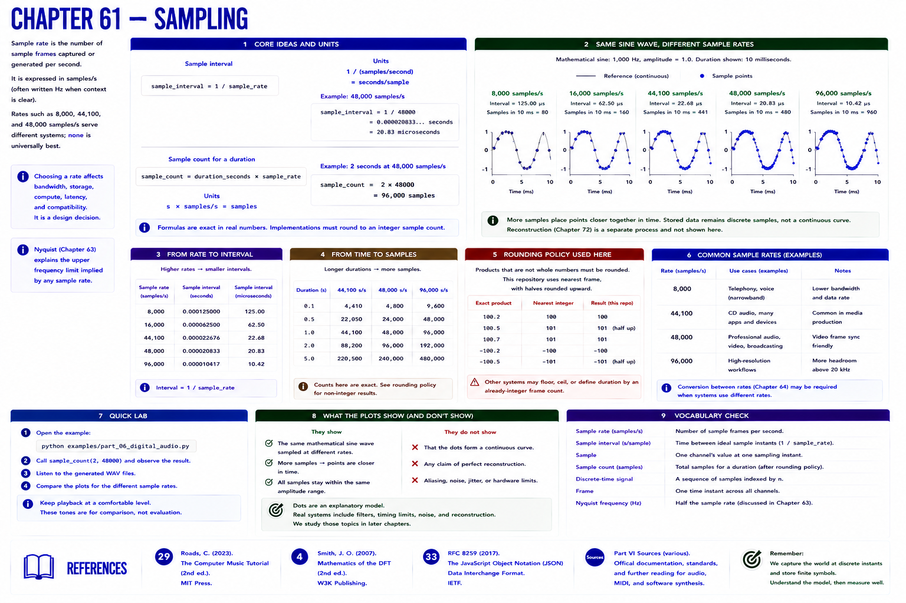

# Chapter 61 — Sampling

**Sample rate** is the number of sample frames captured or generated per second, expressed in samples/s (often written Hz when context is clear). Rates such as 8,000, 44,100, and 48,000 samples/s serve different systems; none is universally best.

`sample_interval = 1 / sample_rate`

At 48,000 samples/s, one interval is about 20.83 microseconds. Units expose the cancellation: `1 / (samples/second) = seconds/sample`. For duration:

`sample_count = duration_seconds × sample_rate`

`s × samples/s = samples`. A program still needs a rounding policy when the product is not integral. This repository uses nearest frame, with halves rounded upward, in `sample_count`; streaming systems may instead define duration from an already-integer frame count.

## Lab

Call `sample_count(2, 48000)` and obtain 96,000 frames. Compare the same mathematical sine sampled at the rates in the figure; distinguish the reference curve from a claim of perfect reconstruction. Tests cover exact and explicitly rounded cases.

## References

- Curtis Roads, *The Computer Music Tutorial*, 2nd ed. (MIT Press, 2023), [bibliography §29](../../references/bibliography.md#29).
- Julius O. Smith III, *Mathematics of the DFT*, 2nd ed. (2007), [bibliography §4](../../references/bibliography.md#4).
- Additional chapter-specific standards and official documentation are indexed in the [Part VI sources](../../references/bibliography.md#part-vi-sources).
