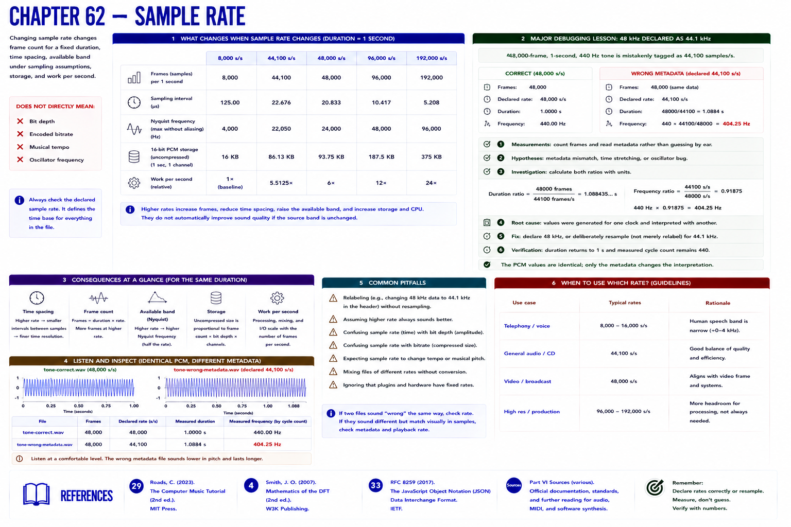

# Chapter 62 — Sample Rate

Changing sample rate changes frame count for a fixed duration, time spacing, available band under sampling assumptions, storage, and work per second. It does **not** directly mean bit depth, encoded bitrate, musical tempo, or oscillator frequency.

## Major debugging lesson: 48 kHz declared as 44.1 kHz

**Symptom:** a 48,000-frame, 1-second 440 Hz tone is tagged 44,100 samples/s. Playback lasts `48000/44100 = 1.0884 s`; frequency becomes `440 × 44100/48000 = 404.25 Hz`.

**Measurements:** count frames and read metadata rather than guessing by ear. **Hypotheses:** metadata mismatch, time stretching, or oscillator bug. **Investigation:** calculate both ratios with units. **Root cause:** values were generated for one clock and interpreted with another. **Fix:** declare 48 kHz, or deliberately resample (not merely relabel) for 44.1 kHz. **Verification:** duration returns to 1 s and measured cycle count remains 440.

The generated `tone-correct.wav` and `tone-wrong-metadata.wav` contain identical PCM values but different rate metadata. Listen comfortably and inspect both; the bug changes pitch and duration together.

## References

- Curtis Roads, *The Computer Music Tutorial*, 2nd ed. (MIT Press, 2023), [bibliography §29](../../references/bibliography.md#29).
- Julius O. Smith III, *Mathematics of the DFT*, 2nd ed. (2007), [bibliography §4](../../references/bibliography.md#4).
- Additional chapter-specific standards and official documentation are indexed in the [Part VI sources](../../references/bibliography.md#part-vi-sources).
