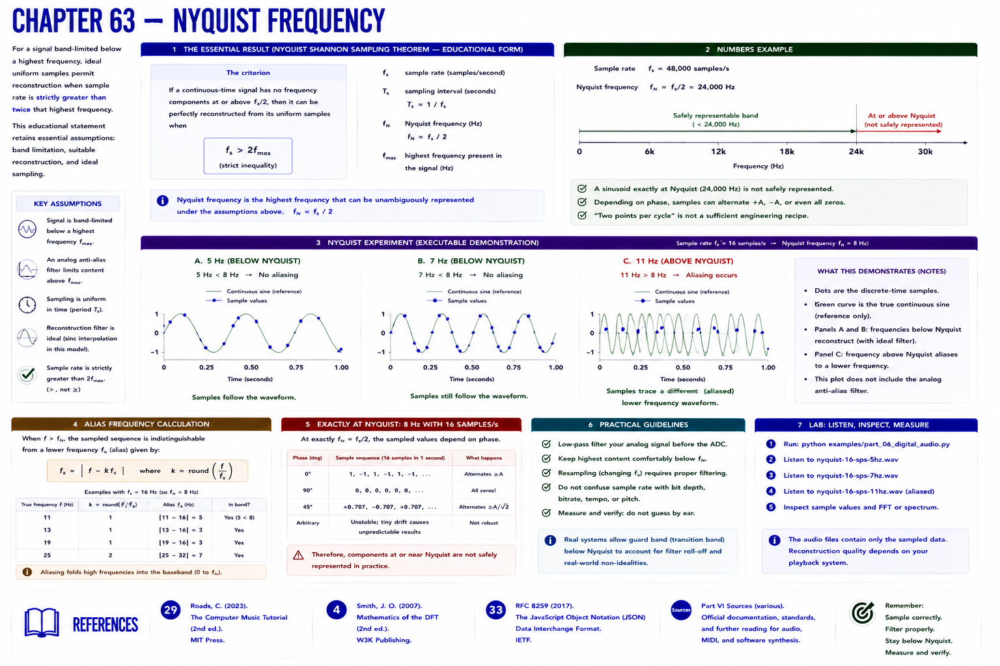

# Chapter 63 — Nyquist Frequency

For a signal band-limited below a highest frequency, ideal uniform samples permit reconstruction when sample rate is **strictly greater than twice** that highest frequency. This educational statement retains essential assumptions: band limitation, suitable reconstruction, and ideal sampling. Real systems need transition bands and anti-alias filters.

`nyquist_frequency = sample_rate / 2`

At 48,000 samples/s the Nyquist frequency is 24,000 Hz. A sinusoid exactly at Nyquist is not safely represented: phase can yield alternating values or even all zeros. “Two points per cycle” is therefore not a sufficient engineering recipe.

The executable plot uses 16 samples/s (Nyquist 8 Hz) and shows 5, 7, and 11 Hz sample sequences. The first two are below Nyquist, the latter above. This visual prepares the alias calculation; it does not model the analog anti-alias filter.

## References

- Curtis Roads, *The Computer Music Tutorial*, 2nd ed. (MIT Press, 2023), [bibliography §29](../../references/bibliography.md#29).
- Julius O. Smith III, *Mathematics of the DFT*, 2nd ed. (2007), [bibliography §4](../../references/bibliography.md#4).
- Additional chapter-specific standards and official documentation are indexed in the [Part VI sources](../../references/bibliography.md#part-vi-sources).
