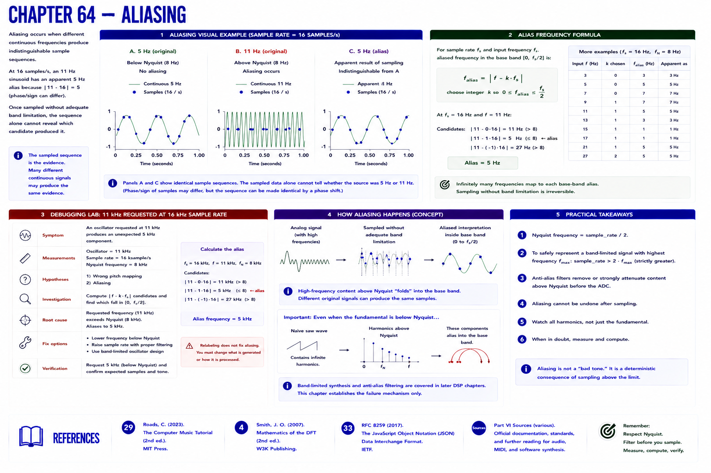

# Chapter 64 — Aliasing

**Aliasing** occurs when different continuous frequencies produce indistinguishable sample sequences. At 16 samples/s, an 11 Hz sinusoid has an apparent 5 Hz alias because `|11 - 16| = 5` (phase/sign can differ). Once sampled without adequate band limitation, the sequence alone cannot reveal which candidate produced it.

## Debugging lab

**Symptom:** an oscillator requested at 11 kHz produces an unexpected 5 kHz component at 16 kHz sample rate. **Measurements:** oscillator 11 kHz; rate 16 ksample/s; Nyquist 8 kHz. **Hypotheses:** wrong pitch mapping or aliasing. **Investigation:** compare `|f - k·sample_rate|` candidates in the base band. **Root cause:** oscillator exceeds Nyquist. **Fix:** lower frequency, raise rate with appropriate filtering, or use a properly band-limited oscillator design. **Verification:** request 5 kHz below Nyquist and check expected samples.

Naive saw/square oscillators also contain harmonics above Nyquist even when their fundamental is below it. Band-limited synthesis and anti-alias filtering belong to later DSP; this chapter only establishes the failure.

## References

- Curtis Roads, *The Computer Music Tutorial*, 2nd ed. (MIT Press, 2023), [bibliography §29](../../references/bibliography.md#29).
- Julius O. Smith III, *Mathematics of the DFT*, 2nd ed. (2007), [bibliography §4](../../references/bibliography.md#4).
- Additional chapter-specific standards and official documentation are indexed in the [Part VI sources](../../references/bibliography.md#part-vi-sources).
