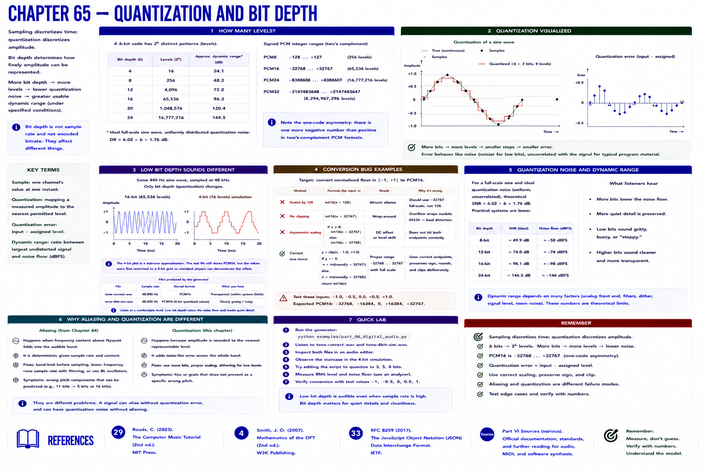

# Chapter 65 — Quantization and Bit Depth

Sampling discretizes **time**; quantization discretizes **amplitude**. A `b`-bit code has `2^b` patterns: 8-bit has 256 and 16-bit has 65,536. Signed PCM assigns those patterns across negative and positive integers; mappings are often asymmetric by one code (PCM16 is −32768…32767).

The difference between input and assigned level is **quantization error**. More bit depth gives more levels and, under specified signal/noise assumptions, greater usable dynamic range. It is not sample rate or bitrate.

Run the generator and compare `tone-correct.wav` with the intentionally four-bit-quantized simulation at safe level. Its file still stores PCM16; its *values* were first restricted to a four-bit grid so standard players can demonstrate the effect.

## Conversion bug

Scaling normalized float by 128 and writing it as PCM16 makes near-silence; multiplying without clipping can wrap or distort in careless code. Preserve sign, use the target endpoints, clip or reject out-of-range values deliberately, and test −1, 0, +1 plus intermediate values.

## References

- Curtis Roads, *The Computer Music Tutorial*, 2nd ed. (MIT Press, 2023), [bibliography §29](../../references/bibliography.md#29).
- Julius O. Smith III, *Mathematics of the DFT*, 2nd ed. (2007), [bibliography §4](../../references/bibliography.md#4).
- Additional chapter-specific standards and official documentation are indexed in the [Part VI sources](../../references/bibliography.md#part-vi-sources).
