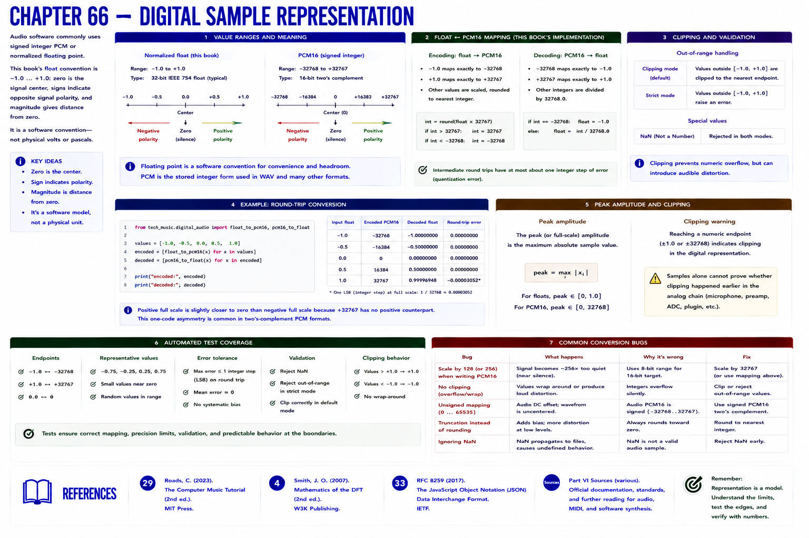

# Chapter 66 — Digital Sample Representation



Audio software commonly uses signed integer PCM or normalized floating point. This book's float convention is `-1.0 … +1.0`: zero is the signal center, signs indicate opposite signal polarity, and magnitude gives distance from zero. It is a software convention—not physical volts or pascals.

PCM16 uses −32768…32767. The implementation maps −1 exactly to −32768 and +1 to 32767. Intermediate round trips have at most about one integer step of error. Values beyond normalized bounds are **clipped** by default or rejected in strict mode; NaN is rejected.

```python
from tech_music.digital_audio import float_to_pcm16, pcm16_to_float
encoded = [float_to_pcm16(x) for x in [-1, -.5, 0, .5, 1]]
decoded = [pcm16_to_float(x) for x in encoded]
```

Peak amplitude is the maximum absolute sample value. Reaching a numeric endpoint is a clipping warning, but samples alone cannot prove whether an earlier analog stage clipped. Automated tests cover endpoints, zero, representative values, error tolerance, validation, and clipping.

## References

- Curtis Roads, *The Computer Music Tutorial*, 2nd ed. (MIT Press, 2023), [bibliography §29](../../references/bibliography.md#29).
- Julius O. Smith III, *Mathematics of the DFT*, 2nd ed. (2007), [bibliography §4](../../references/bibliography.md#4).
- Additional chapter-specific standards and official documentation are indexed in the [Part VI sources](../../references/bibliography.md#part-vi-sources).
