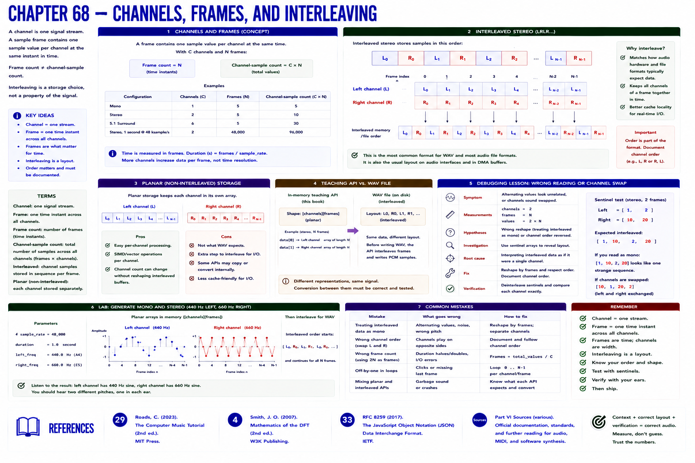

# Chapter 68 — Channels, Frames, and Interleaving



A **channel** is one signal stream. Mono has one; stereo commonly has left and right; multichannel has more. A **sample frame** contains one simultaneous sample value per channel. Consequently, frame count is not channel-sample count.

Interleaved stereo stores:

```text
L0, R0, L1, R1, L2, R2, ...
```


Planar storage instead keeps channel arrays separately. The lab creates mono and stereo, with 440 Hz left and 660 Hz right. In memory its teaching API accepts shape `[channels][frames]`, then explicitly interleaves for WAV.

## Debugging lesson

**Symptom:** alternating values appear unrelated, or channels swap. **Measurements:** channels=2, frames=N, values=2N. **Hypotheses:** wrong reshape or channel order. **Investigation:** use sentinel arrays `[1,2]` and `[10,20]`; expected output is `[1,10,2,20]`. **Root cause:** treating interleaved values as mono. **Fix:** reshape by complete frames and document channel order. **Verification:** deinterleave sentinels and compare each channel exactly.

## References

- Curtis Roads, *The Computer Music Tutorial*, 2nd ed. (MIT Press, 2023), [bibliography §29](../../references/bibliography.md#29).
- Julius O. Smith III, *Mathematics of the DFT*, 2nd ed. (2007), [bibliography §4](../../references/bibliography.md#4).
- Additional chapter-specific standards and official documentation are indexed in the [Part VI sources](../../references/bibliography.md#part-vi-sources).
