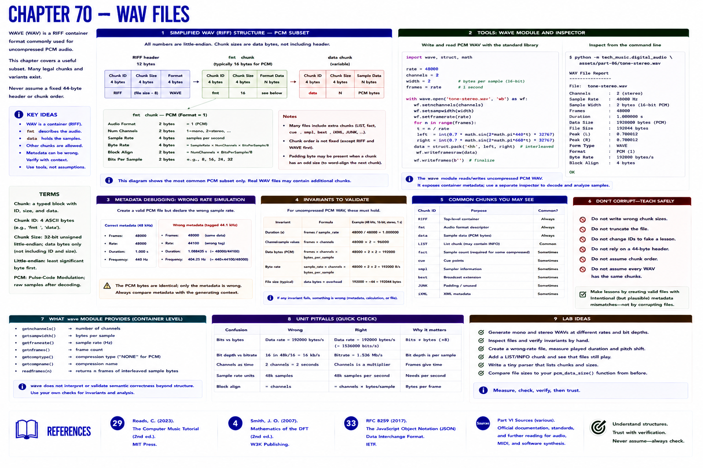

# Chapter 70 — WAV Files



WAVE is a RIFF container. A useful PCM subset begins with `RIFF` and `WAVE`, includes a `fmt ` chunk describing encoding, channels, sample rate, block alignment, and bit depth, and a `data` chunk containing sample bytes. Other legal chunks and variants exist, so never assume every WAV has a fixed 44-byte header.


The standard-library `wave` module writes and reads uncompressed PCM WAV. Run the Part VI example, then:

```bash
python -m tech_music.digital_audio assets/part-06/tone-stereo.wav
```

The report derives rate, two channels, width, frame count, duration, and peak from the file. `wave` exposes container metadata while the inspector decodes data samples.

## Metadata debugging

A safe simulation writes valid PCM with deliberately wrong rate metadata. Validate invariants: `duration = frames/rate`, `sample_values = frames×channels`, and `data_bytes = frames×channels×sample_width`. Wrong metadata can still be structurally valid, so compare it with the generating context. Do not corrupt chunk sizes merely to make a lesson.

## References

- Curtis Roads, *The Computer Music Tutorial*, 2nd ed. (MIT Press, 2023), [bibliography §29](../../references/bibliography.md#29).
- Julius O. Smith III, *Mathematics of the DFT*, 2nd ed. (2007), [bibliography §4](../../references/bibliography.md#4).
- Additional chapter-specific standards and official documentation are indexed in the [Part VI sources](../../references/bibliography.md#part-vi-sources).
