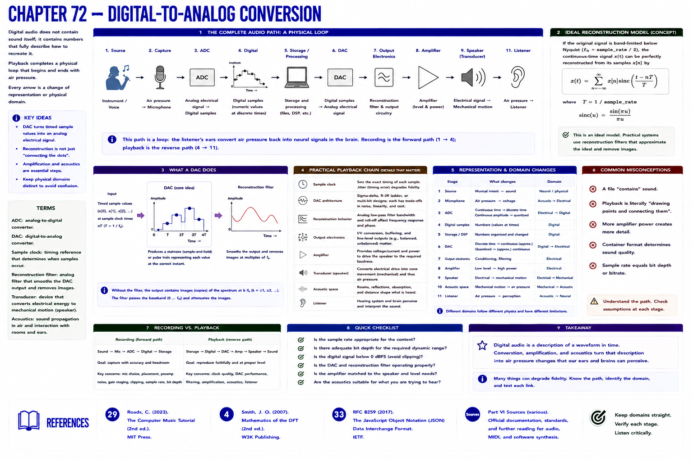

# Chapter 72 — Digital-to-Analog Conversion



Playback completes a physical loop:

```text
instrument/voice → air pressure → microphone → analog electrical signal
→ ADC → digital samples → storage/processing → DAC → analog electrical signal
→ amplifier → speaker → air pressure → listener
```


A DAC produces an electrical representation from timed sample values. Playback is not literally a drawing program that connects dots. Practical conversion includes a sample clock, reconstruction behavior/filtering, output electronics, amplification, transducer mechanics, and the acoustic space. An ideal band-limited reconstruction model uses shifted sinc functions; this part does not derive it.

The amplifier supplies suitable level/power and the speaker transduces electrical drive into mechanical motion, changing air pressure. Each arrow changes representation or physical domain. Keeping those domains distinct prevents the false claim that a file “contains sound.”

## References

- Curtis Roads, *The Computer Music Tutorial*, 2nd ed. (MIT Press, 2023), [bibliography §29](../../references/bibliography.md#29).
- Julius O. Smith III, *Mathematics of the DFT*, 2nd ed. (2007), [bibliography §4](../../references/bibliography.md#4).
- Additional chapter-specific standards and official documentation are indexed in the [Part VI sources](../../references/bibliography.md#part-vi-sources).
