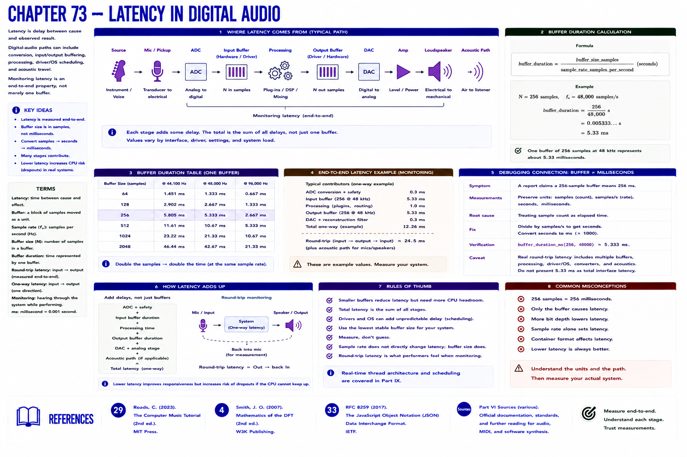

# Chapter 73 — Latency in Digital Audio

Latency is delay between cause and observed result. Digital-audio paths can include conversion, input/output buffering, processing, driver/operating-system scheduling, and acoustic travel. **Monitoring latency** is an end-to-end property, not merely one buffer.

`buffer_duration = buffer_size_samples / sample_rate_samples_per_second`

For 256 samples at 48,000 samples/s: `256/48000 s = 0.005333 s = 5.33 ms`.

## Debugging connection

**Symptom:** a report claims a 256-sample buffer means 256 ms. **Measurements:** preserve units. **Root cause:** treating sample count as elapsed time. **Fix:** divide by samples/s, then multiply seconds by 1000 ms/s. **Verification:** `buffer_duration_ms(256, 48000)` returns about 5.333. Real round-trip latency can include multiple buffers and fixed costs, so do not present 5.33 ms as the complete interface latency. Real-time thread architecture remains Part IX scope.

## References

- Curtis Roads, *The Computer Music Tutorial*, 2nd ed. (MIT Press, 2023), [bibliography §29](../../references/bibliography.md#29).
- Julius O. Smith III, *Mathematics of the DFT*, 2nd ed. (2007), [bibliography §4](../../references/bibliography.md#4).
- Additional chapter-specific standards and official documentation are indexed in the [Part VI sources](../../references/bibliography.md#part-vi-sources).
