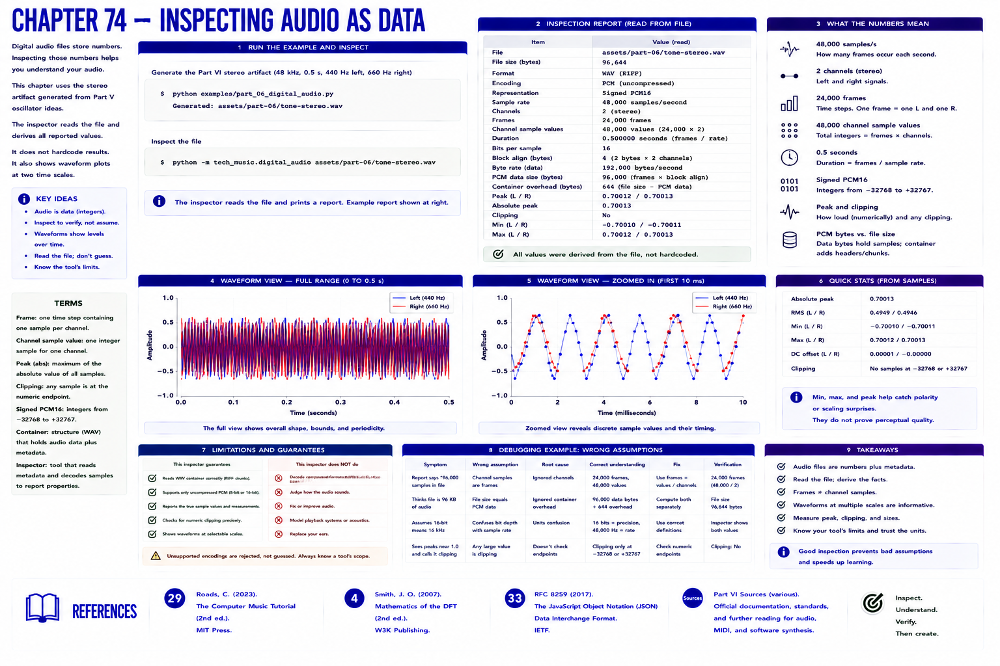

# Chapter 74 — Inspecting Audio as Data



Use the stereo artifact generated from Part V oscillator ideas:

```bash
python examples/part_06_digital_audio.py
python -m tech_music.digital_audio assets/part-06/tone-stereo.wav
```

The inspector reads rather than hardcodes its report: path, 48,000 sample/s, 2 channels, 24,000 frames, 48,000 channel sample values, 0.5 s, signed PCM16 representation, peak, clipping flag, and 96,000 PCM bytes. File size also includes the WAV container.


The complete-waveform view reveals overall bounds and periodicity; the zoom reveals successive discrete values. Minimum/maximum and absolute peak catch polarity or scaling surprises, but a waveform plot cannot certify perceived quality. The capstone intentionally supports only uncompressed 8/16-bit PCM WAV, reports that limitation, and rejects unsupported encodings rather than guessing.

## References

- Curtis Roads, *The Computer Music Tutorial*, 2nd ed. (MIT Press, 2023), [bibliography §29](../../references/bibliography.md#29).
- Julius O. Smith III, *Mathematics of the DFT*, 2nd ed. (2007), [bibliography §4](../../references/bibliography.md#4).
- Additional chapter-specific standards and official documentation are indexed in the [Part VI sources](../../references/bibliography.md#part-vi-sources).
