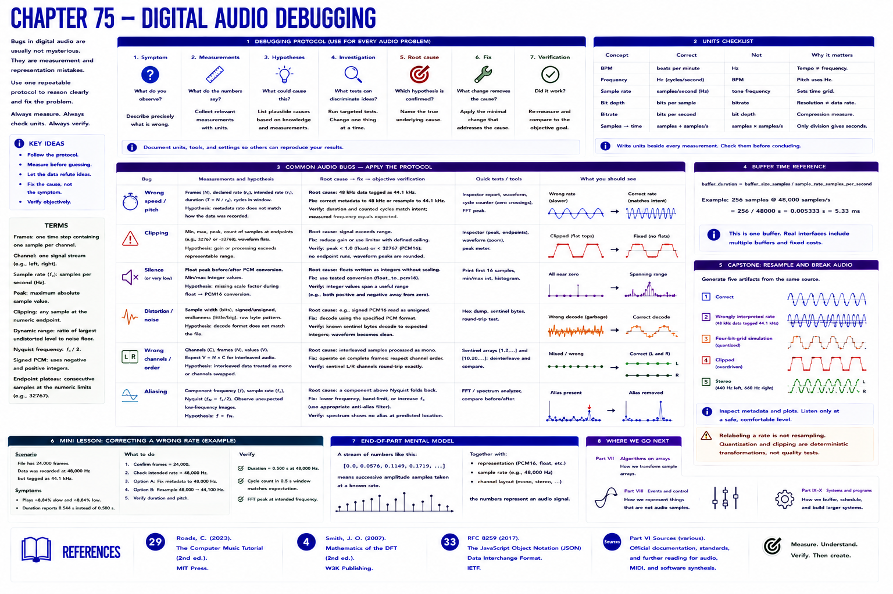

# Chapter 75 — Digital Audio Debugging

Use one repeatable protocol: **Symptom → Measurements → Hypotheses → Investigation → Root cause → Fix → Verification**.

| Bug | Measurements and hypothesis | Root cause → fix → objective verification |
|---|---|---|
| Wrong speed/pitch | frames, declared/intended rates; metadata mismatch? | 48 k data tagged 44.1 k → correct metadata or resample → duration and cycles agree |
| Clipping | min/max/peak and endpoint runs | gain exceeds range → reduce gain/limit deliberately → peak < 1 and no endpoint plateau |
| Silence | float peak before/after PCM conversion | failed PCM16 scale → use tested conversion → intermediate values span expected integers |
| Distortion | byte width, signedness, endianness | signed PCM read unsigned → decode specified PCM format → known sentinel bytes match |
| Wrong channels | channels, frames, values, order | interleaving treated as mono → operate on complete frames → sentinel channels round-trip |
| Aliasing | oscillator rate and Nyquist | component above Nyquist → lower/band-limit or choose suitable rate/filter → no predicted alias |

## Capstone: resample and break audio

Generate five artifacts: correct, wrongly interpreted rate, four-bit-grid simulation, clipped, and stereo. Inspect metadata and plots; listen only at a safe comfortable level. Relabeling a rate is deliberately *not* resampling. Quantization and clipping are deterministic transformations, not subjective quality tests.

## Units checklist

BPM is not Hz; sample rate is not tone frequency; bit depth is not bitrate; samples become seconds only after division by samples/s. Write units beside every measurement.

## End-of-part mental model

`[0.0, 0.0576, 0.1149, 0.1719, ...]` means successive amplitude samples at a known rate. Together with representation and channel layout, the numbers represent an audio signal. Part VII will ask how algorithms transform such arrays; Part VIII distinguishes event/control data; Parts IX–X address buffers and larger programs.

## References

- Curtis Roads, *The Computer Music Tutorial*, 2nd ed. (MIT Press, 2023), [bibliography §29](../../references/bibliography.md#29).
- Julius O. Smith III, *Mathematics of the DFT*, 2nd ed. (2007), [bibliography §4](../../references/bibliography.md#4).
- Additional chapter-specific standards and official documentation are indexed in the [Part VI sources](../../references/bibliography.md#part-vi-sources).
