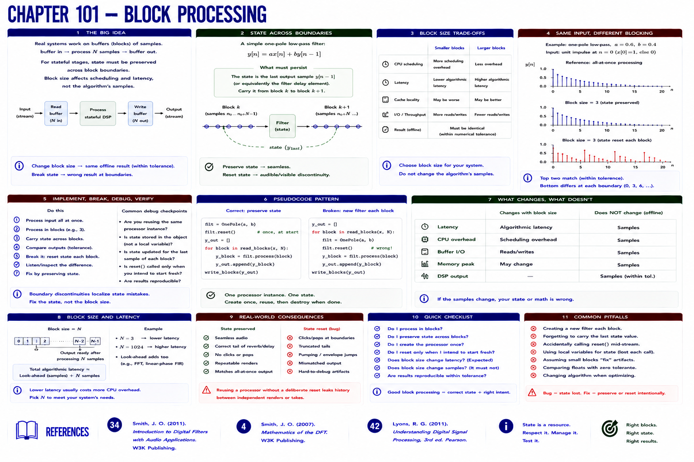

# Chapter 101 — Block Processing



## Hear → see → describe

Practical systems receive buffers: buffer in → process N samples → buffer out. Correct stateful processing preserves state across boundaries. Block size affects scheduling and latency, but must not change this offline algorithm's samples.

## Implement, break, debug, verify

Process the same input all at once and in blocks of 3; tolerance-compare outputs. **Break it:** construct a fresh filter each block. Discontinuities and mismatches locate the boundary-state fault and foreshadow Part IX's real-time constraints.

```bash
python examples/part_07_dsp.py
pytest -q tests/test_dsp.py
```

## References

- Smith, Julius O., *Introduction to Digital Filters with Audio Applications* [bibliography entry 34](../../references/bibliography.md#34).
- Smith, Julius O., *Mathematics of the DFT* [bibliography entry 4](../../references/bibliography.md).
- Lyons, Richard G., *Understanding Digital Signal Processing*, 3rd ed. [bibliography entry 42](../../references/bibliography.md#42).
