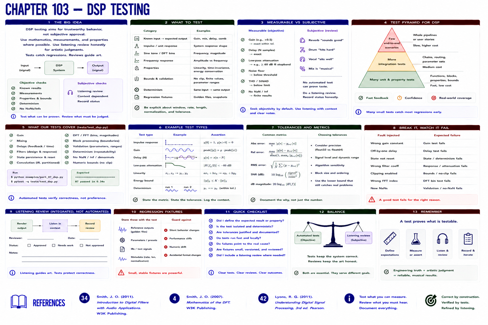

# Chapter 103 — DSP Testing



## Hear → see → describe

Tests use known input → expected output, impulses, sine tones, properties, response measurements, bounds, tolerances, and regression fixtures. Exact gain scaling is objective; low-pass attenuation is measurable; no automated assertion proves reverb is artistically pleasing.

## Implement, break, debug, verify

Run `tests/test_dsp.py`. It checks gain, mixing, delays, state, convolution, DFT bins, blocks, validation, determinism, and bounds. Add listening review separately and record its subjective status honestly.

```bash
python examples/part_07_dsp.py
pytest -q tests/test_dsp.py
```

## References

- Smith, Julius O., *Introduction to Digital Filters with Audio Applications* [bibliography entry 34](../../references/bibliography.md#34).
- Smith, Julius O., *Mathematics of the DFT* [bibliography entry 4](../../references/bibliography.md).
- Lyons, Richard G., *Understanding Digital Signal Processing*, 3rd ed. [bibliography entry 42](../../references/bibliography.md#42).
