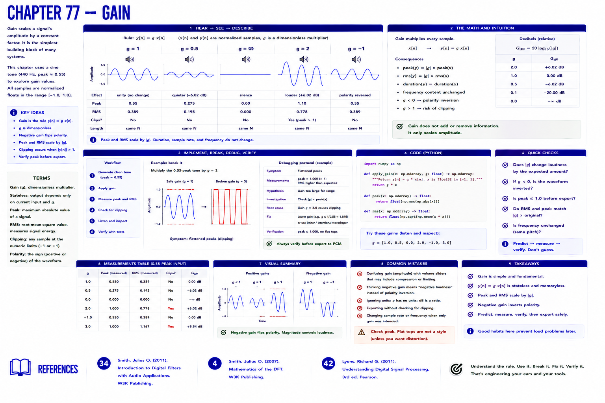

# Chapter 77 — Gain



## Hear → see → describe

Gain is the stateless rule `y[n] = g x[n]`: `x[n]` and `y[n]` are normalized samples, while `g` is a dimensionless multiplier. Hear `g=1`, `0.5`, `0`, `2`, and `-1`; negative gain reverses polarity rather than making a signal 'negatively loud.' Peak and RMS scale by `|g|` until export clips.

## Implement, break, debug, verify

**Break it:** multiply the 0.55-peak tone by 3. The arithmetic is correct but the parameter is unsafe. **Symptom:** flattened peaks. **Evidence:** peak > 1. **Fix:** lower gain or intentionally waveshape; verify before PCM conversion.

```bash
python examples/part_07_dsp.py
pytest -q tests/test_dsp.py
```

## References

- Smith, Julius O., *Introduction to Digital Filters with Audio Applications* [bibliography entry 34](../../references/bibliography.md#34).
- Smith, Julius O., *Mathematics of the DFT* [bibliography entry 4](../../references/bibliography.md).
- Lyons, Richard G., *Understanding Digital Signal Processing*, 3rd ed. [bibliography entry 42](../../references/bibliography.md#42).
