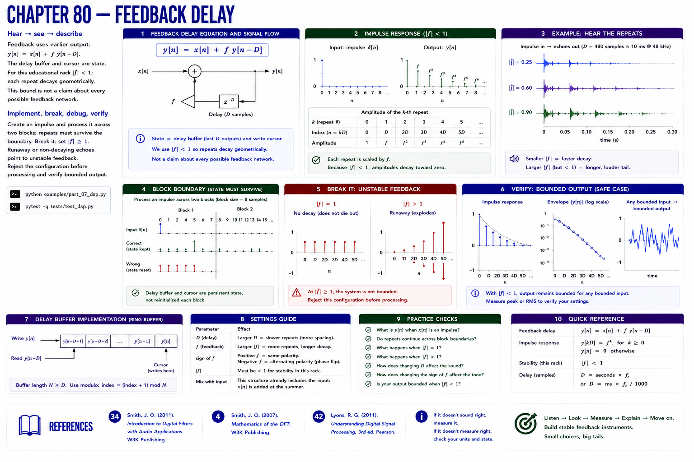

# Chapter 80 — Feedback Delay



## Hear → see → describe

Feedback uses earlier output: `y[n] = x[n] + f y[n-D]`. The delay buffer and cursor are state. For this educational rack `|f| < 1`; each repeat decays geometrically. This bound is not a claim about every possible feedback network.

## Implement, break, debug, verify

Create an impulse and process it across two blocks; repeats must survive the boundary. **Break it:** set `|f| ≥ 1`. Runaway or non-decaying echoes point to unstable feedback. Reject the configuration before processing and verify bounded output.

```bash
python examples/part_07_dsp.py
pytest -q tests/test_dsp.py
```

## References

- Smith, Julius O., *Introduction to Digital Filters with Audio Applications* [bibliography entry 34](../../references/bibliography.md#34).
- Smith, Julius O., *Mathematics of the DFT* [bibliography entry 4](../../references/bibliography.md).
- Lyons, Richard G., *Understanding Digital Signal Processing*, 3rd ed. [bibliography entry 42](../../references/bibliography.md#42).
