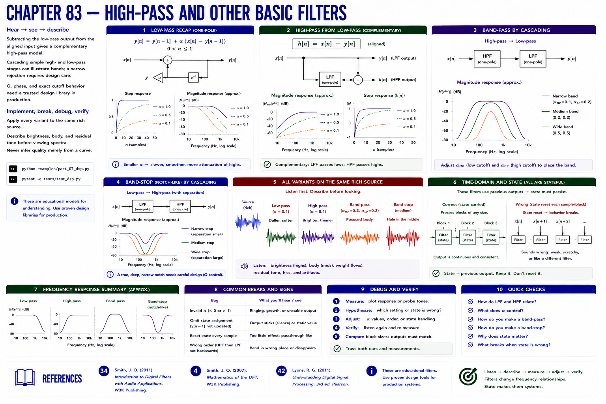

# Chapter 83 — High-Pass and Other Basic Filters



## Hear → see → describe

Subtracting this educational low-pass output from the aligned input gives a complementary high-pass model. Cascading simple high- and low-pass stages can illustrate bands; a narrow rejection requires design care. Q, phase, and exact cutoff behavior need a trusted design library in production.

## Implement, break, debug, verify

Apply every variant to the same rich source. Describe brightness, body, and residual tone before viewing spectra. Never infer quality merely from a curve.

```bash
python examples/part_07_dsp.py
pytest -q tests/test_dsp.py
```

## References

- Smith, Julius O., *Introduction to Digital Filters with Audio Applications* [bibliography entry 34](../../references/bibliography.md#34).
- Smith, Julius O., *Mathematics of the DFT* [bibliography entry 4](../../references/bibliography.md).
- Lyons, Richard G., *Understanding Digital Signal Processing*, 3rd ed. [bibliography entry 42](../../references/bibliography.md#42).
