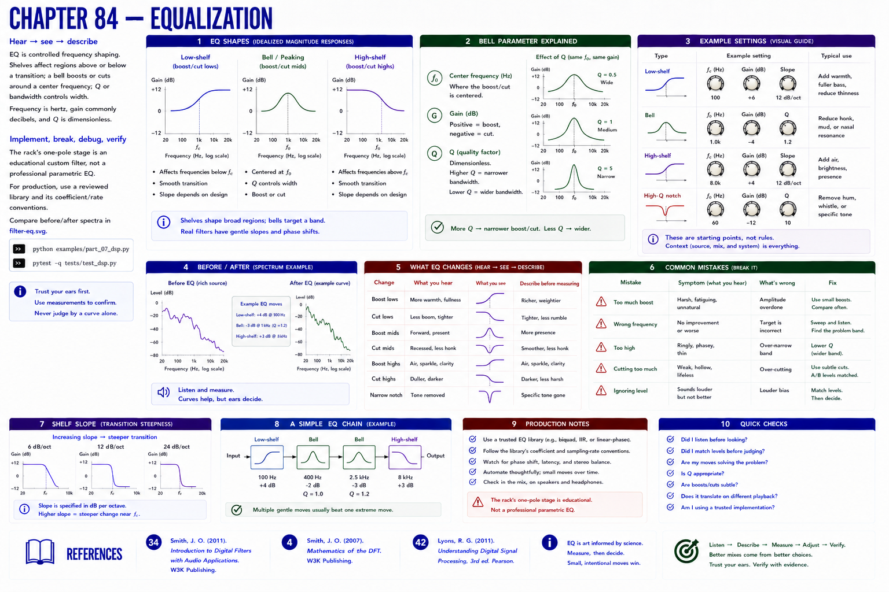

# Chapter 84 — Equalization



## Hear → see → describe

EQ is controlled frequency shaping. Shelves affect regions above or below a transition; a bell boosts or cuts around a center frequency; Q or bandwidth controls width. Frequency is hertz, gain commonly decibels, and Q is dimensionless.

## Implement, break, debug, verify

The rack's one-pole stage is an **educational custom filter**, not a professional parametric EQ. For production, use a reviewed library and its coefficient/rate conventions. Compare before/after spectra in `filter-eq.svg`.

```bash
python examples/part_07_dsp.py
pytest -q tests/test_dsp.py
```

## References

- Smith, Julius O., *Introduction to Digital Filters with Audio Applications* [bibliography entry 34](../../references/bibliography.md#34).
- Smith, Julius O., *Mathematics of the DFT* [bibliography entry 4](../../references/bibliography.md).
- Lyons, Richard G., *Understanding Digital Signal Processing*, 3rd ed. [bibliography entry 42](../../references/bibliography.md#42).
