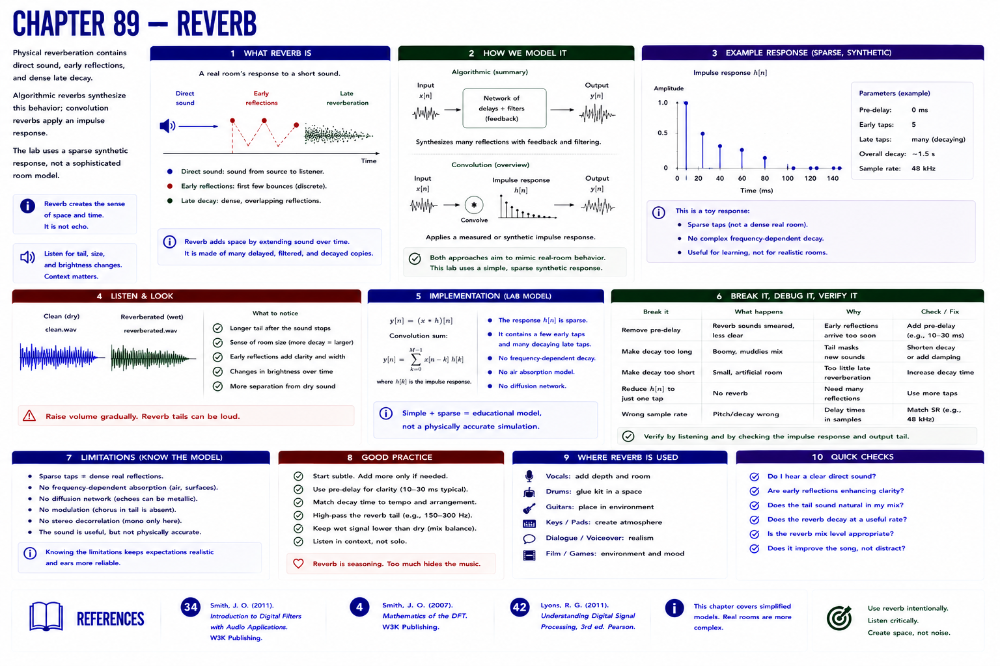

# Chapter 89 — Reverb



## Hear → see → describe

Physical reverberation contains direct sound, early reflections, and dense late decay. Algorithmic reverbs synthesize this behavior; convolution reverbs apply an impulse response. The lab uses a sparse synthetic response, not a sophisticated room model.

## Implement, break, debug, verify

Compare `clean.wav` and `reverberated.wav`; view `delay-reverb.svg`. Note changes in tail and space, then state the toy model's sparse, nonphysical limitations.

```bash
python examples/part_07_dsp.py
pytest -q tests/test_dsp.py
```

## References

- Smith, Julius O., *Introduction to Digital Filters with Audio Applications* [bibliography entry 34](../../references/bibliography.md#34).
- Smith, Julius O., *Mathematics of the DFT* [bibliography entry 4](../../references/bibliography.md).
- Lyons, Richard G., *Understanding Digital Signal Processing*, 3rd ed. [bibliography entry 42](../../references/bibliography.md#42).
